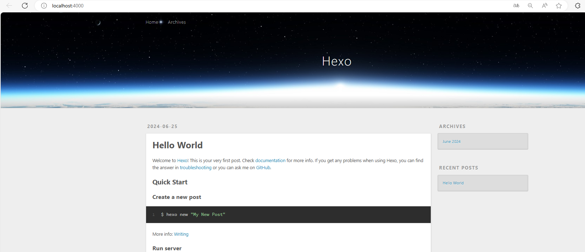

# anyisure-anyisure.github.io


### Hexo 安装
1)执行命令安装 Hexo：
```bash
npm install -g hexo-cli
```


2)初始化创建项目，并进入到项目的根目录下：
```bash
hexo init 项目名
cd 项目名
npm install
```
初始化后，目录结构为:
```t
.
├── _config.yml # 网站配置信息
├── package.json # 应用程序信息，记录项目安装的 npm 插件。
├── scaffolds # 新建文章时的模板文件夹
├── source # 存放用户资源
|   ├── _drafts
|   └── _posts #你的博客文档
└── themes # 主题文件夹
```
3)每次更新文件后
- 清理静态文件： `hexo clean`
- 重新生成静态文件： `hexo g` 或 `hexo generate`

4)执行完毕后启动 hexo：
```bash
hexo server
# 或指定端口
hexo server -p 5000
```

验证：启动完毕后访问 `localhost:4000`


### 配置git相关
#### 修改本地git配置
```bash
# 获取git信息
git config --list # 查看所有配置信息
git config user.name # 查看用户名
git config user.email # 查看用户邮箱

git config --global --list # 查看全局配置信息
git config --global user.name # 查看全局用户名
git config --global user.email # 查看全局用户邮箱

git config --local --list # 查看当前仓库配置信息
git config --local user.name # 查看当前仓库用户名
git config --local user.email # 查看当前仓库用户邮箱


# 设置项目git信息
git config --global user.name 'anyisure' # 设置全局用户名
git config --global user.email 'xx@qq.com' # 设置全局用户邮箱

git config --local user.name 'anyisure' # 设置当前仓库用户名
git config --local user.email 'xx@qq.com'  # 设置当前仓库用户邮箱
```

#### 绑定SSHkey
> 设置完成后为了能够在本地使用git管理github上的项目，需要绑定SSHkey。

1)生成sshKey
```bash
ssh-keygen -t rsa -C xx@qq.com
# -C后面加你在github的用户名邮箱，这样公钥才会被github认可
less ~/.ssh/id_rsa.pub
# 查看公钥内容稍后加入Github账户的sshkey中,
```

2)在github上绑定sshkey

单击头像->`settings`,在设置页面找到`SSH and GPG keys`，单击`New SSH key`新建`SSH KEY`

3)验证
```bash
ssh -T git@github.com
```

### Github Pages 部署
> Github Pages 是 Github 官方提供的一个静态站点托管服务，它允许用户将 GitHub 仓库中的代码转换为可访问的网站。

1)新建仓库： `GitHub 账号用户名 + github.io`，网站才能部署成功，即：`yourusername.github.io`

2)首先我们修改配置文件 `_config.yml` 中的 deploy 配置，填上我们的仓库的地址与提交信息：
```yml
# 资源部署
deploy:
  type: git
  # 部署仓库地址
  repo: https://github.com/anyisure/anyisure.github.io.git
  # 部署分支
  branch: hexo-blog
  # 提交信息
  message: update hexo blog
```
3)安装deploy-git (如有可忽略)：
```bash
npm install --save hexo-deployer-git
```

4)在项目下执行部署命令，它就会自动帮我们编译项目并推送代码到仓库中：

```bash
hexo deploy
# 或者
hexo d 
```

Hexo 编译生成的静态文件资源都默认存放在 `public 目录`下，这条命令会推送 public 目录下的文件强制覆盖到指定的仓库中，Github 就会自动开启部署任务


5)在仓库的 Setting 目录下可以看到 `Pages` 相关的配置，修改部署为 `hexo-blog` 分支根目录下的文件：


注：将分支设置为 `none` 即为关闭 Github Pages 服务。


6)每次的推送成功后，我们可以从 `Actions` 选项卡下看到我们的部署任务是否完成：


### 上传源码到github
> 初始化本地文件夹，提交到github仓库的`hexo-source`分支

```bash
echo "# anyisure.github.io" >> README.md
git init
git add .
git commit -m "first commit"
git branch -M hexo-source
git remote add origin https://github.com/anyisure/anyisure.github.io.git
git push -u origin hexo-source
```

### 修改域名（可选）

1)通过Ping获取默认域名对应的ip，并配置自己的域名映射
```bash
ping username.github.io
```

2)在`\source\`目录下新建`CNAME`文件（注意不要有后缀名，就叫CNAME即可，什么.txt、.js之类的后缀都不能有），在CNAME文件中添加上你购买的域名。

3)配置username.github.io仓库。
打开`username.github.io`，点击仓库页面右上角的`setting`-> `Pages`栏，在`Custom domain`中填入你购买的域名。

### 修改主题

1) 从[hexo主题网址](https://hexo.io/themes/)找到合适的主题
2) 安装主题，主题文件在`themes/主题名`目录下
3) 修改配置应用主题

修改根目录下的`_config.yml`，把主题改为`对应的主题名`
```YAML
theme: 主题名
```

### 添加分类页面和标签页面
#### 添加分类页面
1)在hexo根目录执行以下命令，创建“分类”页面
```bash
hexo new page categories # 创建“分类”页面
```

2)打开`/sources/categories/index.md`
在它的头部加上`type`属性。
```diff
  ---
  title: categories
  date: 2017-05-27 13:47:40
+ type: "categories"
  ---
 ``` 

3)给文章添加分类
> 例如我要给Hello-world这篇文章添加分类，打开`/sources/_posts/Hello-woeld.md`,修改他的头部内容为：
```diff
  ---
  title: Hello-World
  date: 2019-04-07 00:38:36
+ categories: 学习笔记
  tags: [node.js, hexo]
  ---
```

#### 添加标签页面
1)在hexo根目录执行以下命令，创建“标签”页面
```bash
hexo new page tags # 创建“标签”页面
```

2)打开`/sources/tags/index.md`
在它的头部加上type属性。
```diff
  ---
  title: tags
  date: 2017-05-27 13:47:40
+ type: "tags"
  ---
```  
3)给文章添加标签
> 例如我要给Hello-world这篇文章添加标签，打开`/sources/_posts/Hello-world.md`,修改他的头部内容为：
```diff
  ---
  title: Hello-World
  date: 2019-04-07 00:38:36
  categories: 学习笔记
+ tags: [node.js, hexo]  # 逗号是英文逗号
  ---
```
第二种写法是用-短划线列出来
```diff
  ---
  title: Hello-World
  date: 2019-04-07 00:38:36
  categories: 学习笔记
+ tags:
+   - node.js # 注意短线后有空格
+   - Hexo
  ---
```


### 生成永久链接
1)安装插件
```bash
npm install hexo-abbrlink --save
```
2)使用

修改 `_config.yml` ：
```yml
## permalink: :year/:month/:day/:title/
permalink: posts/:abbrlink.html  ## 此处可以自己设置
```
增加以下配置：（还是这个 yml）
```yml
## abbrlink config
abbrlink:
  alg: crc32      #support crc16(default) and crc32 进制
  rep: hex        #support dec(default) and hex  算法
  drafts: false   #(true)Process draft,(false)Do not process draft. false(default) 
  ## Generate categories from directory-tree
  ## depth: the max_depth of directory-tree you want to generate, should > 0
  auto_category:
```


### 发布文章


## hexo基本配置
在文件根目录下的`_config.yml`，就是整个hexo框架的配置文件了。可以在里面修改大部分的配置。详细可参考官方的配置描述。

### 网站
|参数|	描述|
|---|-----|
|title	|网站标题|
|subtitle	|网站副标题|
|description	|网站描述,主要用于SEO，告诉搜索引擎一个关于您站点的简单描述，通常建议在其中包含您网站的关键词。|
|author	|您的名字|
|language	|网站使用的语言|
|timezone	|网站时区。Hexo 默认使用您电脑的时区。时区列表。比如说：America/New_York, Japan, 和 UTC 。|


### 网址
|参数|	描述|
|---|-----|
|url	|网址,网站域名|
|root	|网站根目录|
|permalink	|文章的 永久链接 格式。如：test.md，自动生成的地址就是http://yoursite.com/2024/06/25/test。|
|permalink_defaults	|永久链接中各部分的默认值|