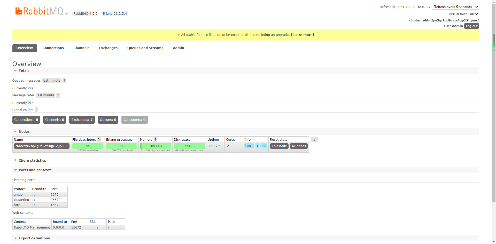
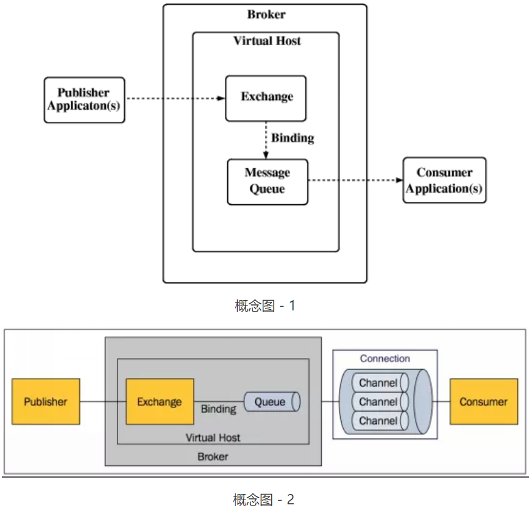

## 介绍

> RabbitMQ是实现了高级消息队列协议（AMQP）的开源消息代理软件（亦称面向消息的中间件）。RabbitMQ是一套开源（MPL）的消息队列服务软件，是由 LShift 提供的一个 Advanced Message Queuing Protocol (AMQP) 的开源实现，由以高性能、健壮以及可伸缩性出名的 Erlang 写成。

官网：https://www.rabbitmq.com

### 1.1、 消息队列概述
消息队列中间件是分布式系统中重要的组件，主要解决应用耦合、异步消息、流量削锋等问题。实现高性能、高可用、可伸缩和最终一致性架构。是大型分布式系统不可缺少的中间件。

目前在生产环境，使用较多的消息队列有`ActiveMQ`、`RabbitMQ`、`ZeroMQ`、`Kafka`、`MetaMQ`、`RocketMQ`等。

### 1.2、 消息队列应用场景
下面详细介绍一下消息队列在实际应用中常用的使用场景分为异步处理、应用解耦、流量削锋和消息通讯四个场景。

## Centos8安装RabbitMQ
> 由于 rabbitmq 是基于 erlang 语言开发的，所以必须先安装 erlang

安装教程：https://www.rabbitmq.com/docs/download

- ~~erlang安装包地址：https://www.erlang.org/patches/otp-24.3.4.5~~
- ~~rabbitmq安装包地址：
https://github.com/rabbitmq/rabbitmq-server/releases/download/v3.9.15/rabbitmq-server-3.9.15-1.el8.noarch.rpm
https://packagecloud.io/rabbitmq/rabbitmq-server~~

### 环境准备
> 为`RabbitMQ` 和 `Modern Erlang`添加 `Yum Repositories`

配置Yum仓库镜像：`vim /etc/yum.repos.d/rabbitmq.repo`

```conf
# In /etc/yum.repos.d/rabbitmq.repo

##
## Zero dependency Erlang RPM
##

[modern-erlang]
name=modern-erlang-el8
# Use a set of mirrors maintained by the RabbitMQ core team.
# The mirrors have significantly higher bandwidth quotas.
baseurl=https://yum1.rabbitmq.com/erlang/el/8/$basearch
        https://yum2.rabbitmq.com/erlang/el/8/$basearch
repo_gpgcheck=1
enabled=1
gpgkey=https://github.com/rabbitmq/signing-keys/releases/download/3.0/cloudsmith.rabbitmq-erlang.E495BB49CC4BBE5B.key
gpgcheck=1
sslverify=1
sslcacert=/etc/pki/tls/certs/ca-bundle.crt
metadata_expire=300
pkg_gpgcheck=1
autorefresh=1
type=rpm-md

[modern-erlang-noarch]
name=modern-erlang-el8-noarch
# Use a set of mirrors maintained by the RabbitMQ core team.
# The mirrors have significantly higher bandwidth quotas.
baseurl=https://yum1.rabbitmq.com/erlang/el/8/noarch
        https://yum2.rabbitmq.com/erlang/el/8/noarch
repo_gpgcheck=1
enabled=1
gpgkey=https://github.com/rabbitmq/signing-keys/releases/download/3.0/cloudsmith.rabbitmq-erlang.E495BB49CC4BBE5B.key
       https://github.com/rabbitmq/signing-keys/releases/download/3.0/rabbitmq-release-signing-key.asc
gpgcheck=1
sslverify=1
sslcacert=/etc/pki/tls/certs/ca-bundle.crt
metadata_expire=300
pkg_gpgcheck=1
autorefresh=1
type=rpm-md

[modern-erlang-source]
name=modern-erlang-el8-source
# Use a set of mirrors maintained by the RabbitMQ core team.
# The mirrors have significantly higher bandwidth quotas.
baseurl=https://yum1.rabbitmq.com/erlang/el/8/SRPMS
        https://yum2.rabbitmq.com/erlang/el/8/SRPMS
repo_gpgcheck=1
enabled=1
gpgkey=https://github.com/rabbitmq/signing-keys/releases/download/3.0/cloudsmith.rabbitmq-erlang.E495BB49CC4BBE5B.key
       https://github.com/rabbitmq/signing-keys/releases/download/3.0/rabbitmq-release-signing-key.asc
gpgcheck=1
sslverify=1
sslcacert=/etc/pki/tls/certs/ca-bundle.crt
metadata_expire=300
pkg_gpgcheck=1
autorefresh=1


##
## RabbitMQ Server
##

[rabbitmq-el8]
name=rabbitmq-el8
baseurl=https://yum2.rabbitmq.com/rabbitmq/el/8/$basearch
        https://yum1.rabbitmq.com/rabbitmq/el/8/$basearch
repo_gpgcheck=1
enabled=1
# Cloudsmith's repository key and RabbitMQ package signing key
gpgkey=https://github.com/rabbitmq/signing-keys/releases/download/3.0/cloudsmith.rabbitmq-server.9F4587F226208342.key
       https://github.com/rabbitmq/signing-keys/releases/download/3.0/rabbitmq-release-signing-key.asc
gpgcheck=1
sslverify=1
sslcacert=/etc/pki/tls/certs/ca-bundle.crt
metadata_expire=300
pkg_gpgcheck=1
autorefresh=1
type=rpm-md

[rabbitmq-el8-noarch]
name=rabbitmq-el8-noarch
baseurl=https://yum2.rabbitmq.com/rabbitmq/el/8/noarch
        https://yum1.rabbitmq.com/rabbitmq/el/8/noarch
repo_gpgcheck=1
enabled=1
# Cloudsmith's repository key and RabbitMQ package signing key
gpgkey=https://github.com/rabbitmq/signing-keys/releases/download/3.0/cloudsmith.rabbitmq-server.9F4587F226208342.key
       https://github.com/rabbitmq/signing-keys/releases/download/3.0/rabbitmq-release-signing-key.asc
gpgcheck=1
sslverify=1
sslcacert=/etc/pki/tls/certs/ca-bundle.crt
metadata_expire=300
pkg_gpgcheck=1
autorefresh=1
type=rpm-md

[rabbitmq-el8-source]
name=rabbitmq-el8-source
baseurl=https://yum2.rabbitmq.com/rabbitmq/el/8/SRPMS
        https://yum1.rabbitmq.com/rabbitmq/el/8/SRPMS
repo_gpgcheck=1
enabled=1
gpgkey=https://github.com/rabbitmq/signing-keys/releases/download/3.0/cloudsmith.rabbitmq-server.9F4587F226208342.key
gpgcheck=0
sslverify=1
sslcacert=/etc/pki/tls/certs/ca-bundle.crt
metadata_expire=300
pkg_gpgcheck=1
autorefresh=1
type=rpm-md
```

### 通过dnf（yum）安装包

1)Update package metadata:
```bash
dnf update -y
```

2)从官方仓库安装依赖:
```bash
## install these dependencies from standard OS repositories
dnf install -y socat logrotate
```

3)安装 Erlang 和 RabbitMQ:
```bash
## install RabbitMQ and zero dependency Erlang
dnf install -y erlang rabbitmq-server
```

### 启用并启动RabbitMQ服务
一旦安装完成，你需要启用并启动RabbitMQ服务。使用以下命令来启用并启动：

```bash
# 启用rabbitmq-server（开机自动启动）
systemctl enable rabbitmq-server
# 启动rabbitmq-server
systemctl start rabbitmq-server
# 查看服务状态
systemctl status  rabbitmq-server
```
### 安装插件

```bash
# 查看所有插件
rabbitmq-plugins list 
```
#### 设置RabbitMQ管理界面（可选）：
如果你想使用RabbitMQ的Web管理界面，可以使用以下命令开启它：

```bash
rabbitmq-plugins enable rabbitmq_management
```

可通过浏览器访问`http://ip:15672`来访问管理界面。默认的用户名和密码为`guest/guest`。请确保在生产环境中更改默认密码。



#### 安装mqtt协议

```bash
rabbitmq-plugins enable rabbitmq_mqtt
```

#### 
```bash
rabbitmq-plugins enable rabbitmq_federation_management
```

### 配置防火墙（可选）
如果你的CentOS系统上启用了防火墙，确保打开RabbitMQ所使用的端口，通常是5672（AMQP协议）和15672（管理界面）。

例如，使用以下命令开放这些端口：

```bash
sudo firewall-cmd --zone=public --permanent --add-port=5672/tcp
sudo firewall-cmd --zone=public --permanent --add-port=15672/tcp
sudo firewall-cmd --reload
```

### 添加用户

```bash
sudo rabbitmqctl add_user admin StrongPassword
sudo rabbitmqctl set_user_tags admin administrator
sudo rabbitmqctl set_permissions -p / admin ".*" ".*" ".*"
```

### 查看日志
```bash
cd /var/log/rabbitmq
ls
```


## 使用

### AMQP messaging 中的基本概念
#### 基本概念
- 消息（Message）：由有效载荷（playload）和标签（label）组成。其中有效载荷既传输的数据。
- 生产者（producer）：创建消息，发布到代理服务器（Message Broker）。
- 代理服务器（Message Broker）：接收和分发消息的应用，RabbitMQ Server就是消息代理服务器，其中包含概念很多，以RabbitMQ 为例：信道（channel）、队列（queue）、交换器（exchange）、路由键（routing key）、绑定（binding key）、虚拟主机（vhost）等。
- 消费者（consumer）：连接到代理服务器，并订阅到队列（queue）上，代理服务器将发送消息给一个订阅的/监听的消费者，消费者其只能接收消息的一部分：有效载荷（playload）。

#### 术语介绍
- Broker: 接收和分发消息的应用，RabbitMQ Server就是Message Broker。
- Virtual host: 出于多租户和安全因素设计的，把AMQP的基本组件划分到一个虚拟的分组中，类似于网络中的namespace概念。当多个不同的用户使用同一个RabbitMQ server提供的服务时，可以划分出多个vhost，每个用户在自己的vhost创建exchange／queue等。
- Connection: publisher／consumer和broker之间的TCP连接。断开连接的操作只会在client端进行，Broker不会断开连接，除非出现网络故障或broker服务出现问题。
- Channel: 如果每一次访问RabbitMQ都建立一个Connection，在消息量大的时候建立TCP Connection的开销将是巨大的，效率也较低。Channel是在connection内部建立的逻辑连接，如果应用程序支持多线程，通常每个thread创建单独的channel进行通讯，AMQP method包含了channel id帮助客户端和message broker识别channel，所以channel之间是完全隔离的。Channel作为轻量级的Connection极大减少了操作系统建立TCP connection的开销。
- Exchange: message到达broker的第一站，根据分发规则，匹配查询表中的routing key，分发消息到queue中去。常用的类型有：direct (point-to-point), topic (publish-subscribe) and fanout (multicast)。
- Queue: 消息最终被送到这里等待consumer取走。一个message可以被同时拷贝到多个queue中。
- Binding: exchange和queue之间的虚拟连接，binding中可以包含routing key。Binding信息被保存到exchange中的查询表中，用于message的分发依据。
  

