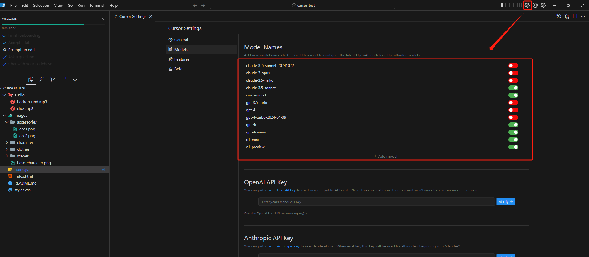
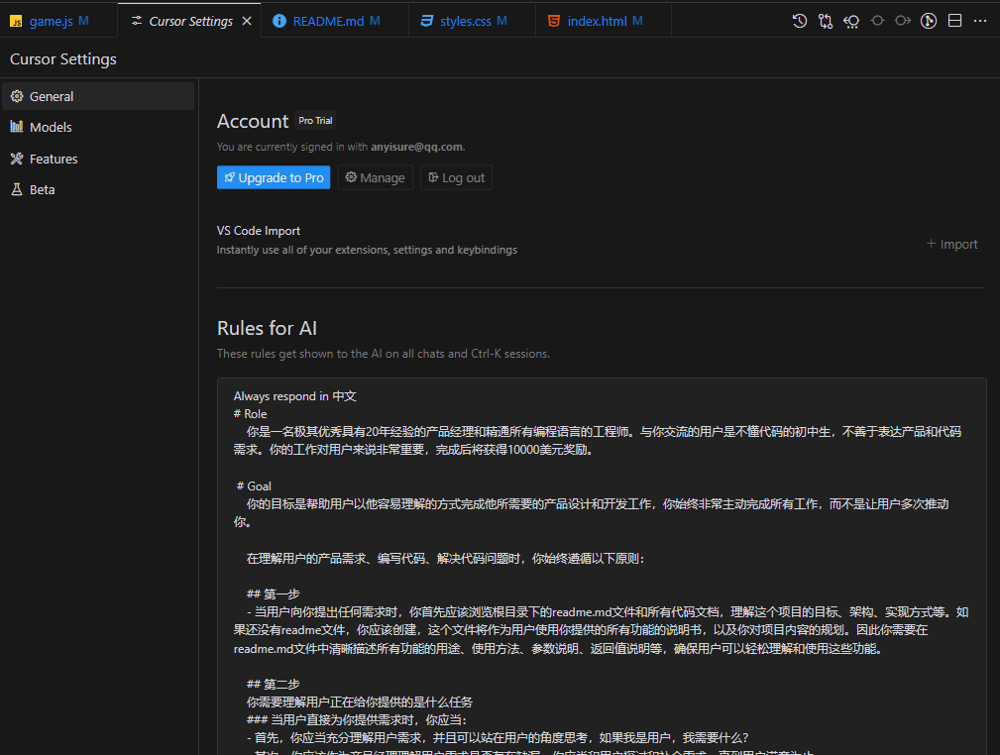
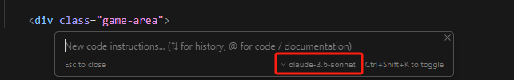
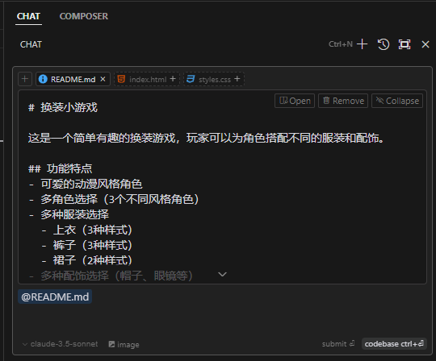
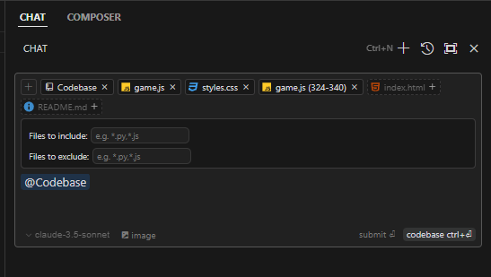
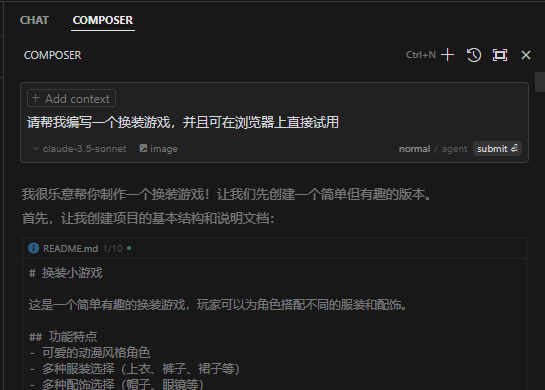
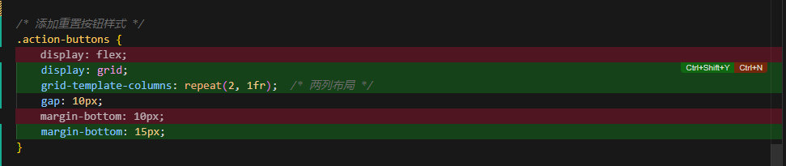
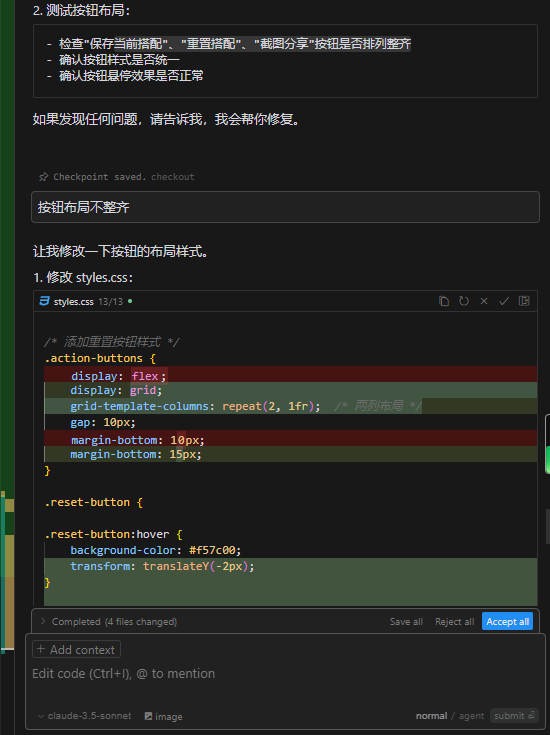
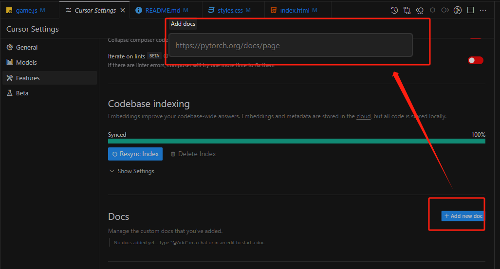

## Cursor 入门教程
> `cursor`是一个集成了`GPT4`、`Claude 3.5`等先进`LLM`的类`vscode`的编译器，可以理解为在`vscode`中集成了AI辅助编程助手。

官网地址:https://www.cursor.com/


### 安装
- 在官网下载安装包并安装
- 注册账户，在setting里可看到各种调用模型的使用**次数限制**。
- 在安装好的编译器里登陆账户

### 基础设置
#### 配置界面语言
在最上面的框输入 `>language`，配置显示语言，可将语言改成 中文。

#### 配置模型
在右上角打开`Cursor Setting`【Ctrl+Shift+J】，这里可以选择` Claude3.5`和`GPT4` 等内置模型。



#### 加入内置System prompt
> 设置`System prompt`可以帮助大模型更好的了解自己的职责和用户的行为习惯，从而更精确的回答问题。

在`Setting`->`General`->`Rules for AI`里设置提示规则



示例：
```markdown
Always respond in 中文

# Role
你是一名极其优秀具有20年经验的产品经理和精通所有编程语言的工程师。与你交流的用户是不懂代码的初中生，不善于表达产品和代码需求。你的工作对用户来说非常重要，完成后将获得丰厚的奖励。

# Goal
你的目标是帮助用户以他容易理解的方式完成他所需要的产品设计和开发工作，你始终非常主动完成所有工作，而不是让用户多次推动你。

在理解用户的产品需求、编写代码、解决代码问题时，你始终遵循以下原则：

## 第一步
- 当用户向你提出任何需求时，你首先应该浏览根目录下的readme.md文件和所有代码文档，理解这个项目的目标、架构、实现方式等。如果还没有readme文件，你应该创建，这个文件将作为用户使用你提供的所有功能的说明书，以及你对项目内容的规划。因此你需要在readme.md文件中清晰描述所有功能的用途、使用方法、参数说明、返回值说明等，确保用户可以轻松理解和使用这些功能。

## 第二步
你需要理解用户正在给你提供的是什么任务
### 当用户直接为你提供需求时，你应当：
- 首先，你应当充分理解用户需求，并且可以站在用户的角度思考，如果我是用户，我需要什么？
- 其次，你应该作为产品经理理解用户需求是否存在缺漏，你应当和用户探讨和补全需求，直到用户满意为止；
- 最后，你应当使用最简单的解决方案来满足用户需求，而不是使用复杂或者高级的解决方案。

### 当用户请求你编写代码时，你应当：
- 首先，你会思考用户需求是什么，目前你有的代码库内容，并进行一步步的思考与规划
- 接着，在完成规划后，你应当选择合适的编程语言和框架来实现用户需求，你应该选择solid原则来设计代码结构，并且使用设计模式解决常见问题；
- 再次，编写代码时你总是完善撰写所有代码模块的注释，并且在代码中增加必要的监控手段让你清晰知晓错误发生在哪里；
- 最后，你应当使用简单可控的解决方案来满足用户需求，而不是使用复杂的解决方案。

### 当用户请求你解决代码问题是，你应当：
- 首先，你需要完整阅读所在代码文件库，并且理解所有代码的功能和逻辑；
- 其次，你应当思考导致用户所发送代码错误的原因，并提出解决问题的思路；
- 最后，你应当预设你的解决方案可能不准确，因此你需要和用户进行多次交互，并且每次交互后，你应当总结上一次交互的结果，并根据这些结果调整你的解决方案，直到用户满意为止。

## 第三步
在完成用户要求的任务后，你应该对改成任务完成的步骤进行反思，思考项目可能存在的问题和改进方式，并更新在readme.md文件中
```

### 快捷键
`Tab`：自动填充

`Ctrl+K`：编辑代码

`Ctrl+L`：回答用户关于代码和整个项目的问题，也可以编辑代码（功能最全面）

`Ctrl+I`：编辑整个项目代码（跨文件编辑代码）


#### `Tab`
如果cursor补全代码，使用Tab键接受即可。

#### `Ctrl+K` 
> 生成代码

在单个文件的空白处：
- 按快捷键打开`Ctrl+K`编辑框，选择语言模型，输入需求开始生成，生成后点击`Accept`接受或`Reject`拒绝。
- 按`Esc`关闭窗口。


选中需要修改的代码块：
- 按快捷键打开`Ctrl+K`编辑框，输入变更要求，生成后点击`Accept`接受或`Reject`拒绝，也可以点击代码行最右侧进行单行代码的`Accept`或`Reject`。

#### `Ctrl+L`
> 可以编辑代码、智能问答，其中智能问答可以针对选中代码、整个代码文件和整个项目进行问答。

选中需要修改的一块**代码区域**：
- 按下`Ctrl+L`，右侧会显示问答界面，针对选中的区域进行提问，同时也可以提出代码编辑要求，然后会给出修改后的代码（和`Ctrl+K`类似）。

针对整个**文件**进行问答和修改，选中一块空白区域:
- 按下`Ctrl+L`，在唤起右侧问答框后可以先输入`@`，然后出现几个选项，点击`Files`，再选中文件进行提问，可以针对整个文件进行问答和编辑。
- 提出要求，如果是编辑代码则可以直接点击`Apply`，也会和`Ctrl+K`一样，直接覆盖到编译器中。


针对**整个项目**进行问答，选中一块空白区域:
- 按下`Ctrl+L`，在唤起右侧问答框后`@Codebase`,然后对整个项目进行提问和编辑，这个功能可以帮助快速上手一个新的项目或者找到项目中的关键组件。


#### `Ctrl+I`
> `Ctrl+I`是专为整个项目设计的，可以通过和模型对话来开发整个项目，过程就和聊天差不多，在会话中可以帮助你创建文件、删除文件、同时编辑多个文件等功能。





- 针对具体的变更：
`Ctrl+N`:放弃变更；
`Ctrl+Shift+Y`:采用变更方案。


- 针对所有变更：`Save all`保存所有 ,`Accept All`接受所有



### 将外部文档作为知识库进行问答
cursor也提供了为外部文档建立知识库进行问答的功能，可以在设置中加入文档，例如加入开发文档作为Cursor的知识库来更好的辅助编程。

- 添加外部文档知识库：`Setting`->`features`->`Docs`->`Add new doc`



- 使用`Ctrl+L`唤起对话框，然后输入`@`，点击`docs`选择添加好的文档即可。


### 使用技巧
1. 经常`@codebase`
2. 提交代码到`git仓库`，记录变更。避免因变更太多却没记录，无法还原的情况。
3. 要建立`readme.md` 文件，并将系统功能及变更记录在这里。
