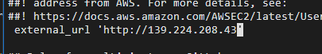
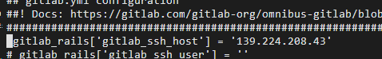
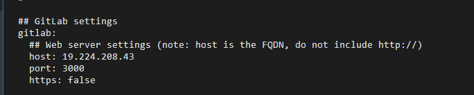

## 1.安装mysql
### 1.1 创建mysql容器
```shell
docker run --name mysql \
--restart=always \
-p 3306:3306 \
-v /data/mysql/log:/var/log/mysql \
-v /data/mysql/data:/var/lib/mysql \
-v /data/mysql/conf.d:/etc/mysql/conf.d \
-e MYSQL_ROOT_PASSWORD=<password> \
-d mysql:8  --lower_case_table_names=1 
```
其中，`<password>`是你要设置的MySQL的初始密码。

让我们来逐个解释一下这个命令的参数：

- `-d`选项表示在后台运行容器。
- `-p 3306:3306`选项将宿主机的3306端口映射到容器的3306端口。这样我们可以通过宿主机上的3306端口访问MySQL数据库。
- `--name mysql`选项指定了容器的名称为mysql。
- `-e MYSQL_ROOT_PASSWORD=<password>`选项设置了MySQL的初始密码。
- `lower_case_table_names=1`设置不区分大小写
- `-v mysql_data:/var/lib/mysql`选项将这个卷挂载到MySQL容器的/var/lib/mysql目录。
- `restart=always`：自启动
- `privileged=true`：权限

### 1.2 连接到MySQL
一旦MySQL容器启动成功，我们可以使用以下命令来连接到MySQL数据库：

`docker exec -it mysql mysql -uroot -p`

这个命令的参数解释如下：

- `docker exec -it mysql`表示我们要执行一个命令在名为mysql的容器内。
- `mysql -uroot -p`表示我们要使用root用户连接到MySQL，并输入密码。
当你运行这个命令后，系统会提示你输入密码。输入之前指定的初始密码，然后按下Enter键。

如果一切顺利，你就成功连接到了MySQL数据库。

### 1.3 修改默认的MySQL配置文件
#### 1.3.1 限制数据库的大小。
编辑主机上的"`/etc/mysql/conf.d/docker.cnf`"文件（如果没有此文件，则创建一个新文件），添加以下内容：
```lni
[mysqld]
innodb_file_per_table = ON
max_allowed_packet = 256M
innodb_log_file_size = 256M
innodb_buffer_pool_size = 8G
```

注意，根据你的系统性能和需求，可以调整`innodb_buffer_pool_size`参数的值。

重新启动MySQL容器，使更改生效：`docker restart my-mysql`

#### 1.3.2 授权远程登陆
```sql
GRANT ALL PRIVILEGES ON *.* TO 'root'@'223.76.126.169' IDENTIFIED BY 'YourPassword' WITH GRANT OPTION;
FLUSH PRIVILEGES;
```

## 2. 部署项目到tomcat
运行命令：
```shell
docker run -d --name test_project -p 86:8080 -v /root/project/testproject/:/usr/local/tomcat/webapps tomcat:7
```
- `/root/project/testproject/`为在服务器上挂载的地址，对应tomcat里的webapps目录
- `86`为外部服务器端口


## 3. 安装gitlab
注：机器配置要大于4g，否则很容易启动不了，报502
### 3.1 下载gitlab镜像
下载gitlab镜像：`docker pull gitlab/gitlab-ce:latest`

### 3.2 创建gitlab容器
```shell
mkdir gitlab gitlab/etc gitlab/log gitlab/opt

docker run -id -p 9980:80 -p 9922:22 -v /root/gitlab/etc:/etc/gitlab  -v /root/gitlab/log:/var/log/gitlab -v /root/gitlab/opt:/var/opt/gitlab --restart always --privileged=true --name gitlab gitlab/gitlab-ce
```
命令解释：
- `-i` 以交互模式运行容器，通常与 -t 同时使用命令解释：
- `-d`  后台运行容器，并返回容器ID
- `-p` 9980:80  将容器内80端口映射至宿主机9980端口，这是访问gitlab的端口
- `-p` 9922:22  将容器内22端口映射至宿主机9922端口，这是访问ssh的端口
- `-v` ./gitlab/etc:/etc/gitlab  将容器/etc/gitlab目录挂载到宿主机./gitlab/etc目录下，若宿主机内此目录不存在将会自动创建，其他两个挂载同这个一样
- `--restart always`  容器自启动
- `--privileged=true`  让容器获取宿主机root权限
- `--name gitlab-test`  设置容器名称为gitlab
- `gitlab/gitlab-ce`  镜像的名称，这里也可以写镜像ID

### 3.3 修改容器内配置文件
#### 3.3.1 先进入容器
进入容器:
```shell
docker exec -it gitlab /bin/bash
```

#### 3.3.2 修改gitlab.rb文件
```shell
# 先进入到gitlab目录
cd /etc/gitlab
# 编辑gitlab.rb文件  
vi gitlab.rb
```

- 1)修改gitlab.rb文件中的IP与端口号
```shell
external_url 'http://xx.xx.xx.xx'   # 在gitlab创建项目时候http地址的host(不用添加端口)
```

- 2)配置ssh协议所使用的访问地址和端口
```shell
gitlab_rails['gitlab_ssh_host'] = '192.168.XX.XX' # 和上一个IP输入的一样
gitlab_rails['gitlab_shell_ssh_port'] = 9922 # 此端口是run时22端口映射的8022端口
```

- 3)`:wq` # 保存配置文件并退出

#### 3.3.3 配置gitlab.yml文件
文件路径： /opt/gitlab/embedded/service/gitlab-rails/config
```shell
# 先进入到config目录下
cd /opt/gitlab/embedded/service/gitlab-rails/config
# 打开编辑gitlab.yml文件
vim gitlab.yml
```

- 修改host 与上面.rb文件修改的一致
- 修改port 为9980


#### 3.3.4 重启gitlab并退出容器
```shell
# 重启
gitlab-ctl restart
# 退出容器
exit
```

## 4.安装gitea

- 安装文件
docker-compose.yaml
```yaml
version: '2.4'
services:
  gitea:
    image: gitea/gitea:1.15.4
    container_name: gitea
    environment:
      - USER_UID=1000
      - USER_GID=1000
    ports:
      - 3000:3000 
      - 3022:22
    mem_limit: 500m
    volumes:
      - /root/gitea/data:/data
    restart: always
```

- 安装命令： `docker-compose up -d`
- 修改配置文件

配置文件位置： /root/gitea/data/gitea/conf/app.ini
```ini
[service]
DISABLE_REGISTRATION              = false
REQUIRE_SIGNIN_VIEW               = ture
REGISTER_EMAIL_CONFIRM            = false
ENABLE_NOTIFY_MAIL                = false
ALLOW_ONLY_EXTERNAL_REGISTRATION  = false
ENABLE_CAPTCHA                    = false
DEFAULT_KEEP_EMAIL_PRIVATE        = false
DEFAULT_ALLOW_CREATE_ORGANIZATION = true
DEFAULT_ENABLE_TIMETRACKING       = true
NO_REPLY_ADDRESS                  = noreply.localhost
```


## 5.安装rabbitmq
### 5.1 下载镜像
镜像尽量选择 带-management后缀的，因为这个是自带Web监控页面
```shell
docker search rabbitmq  # 查找镜像
docker pull rabbitmq    # 拉取镜像
docker pull rabbitmq:3.12-management # 拉取带管理界面的镜像
```

### 5.2 创建rabbitmq容器

- 在本地创建用来挂载的文件目录：`mkdir -p /root/rabbitmq/{data,conf,log}`
- 设置权限：`chmod -R 777 /root/rabbitmq`
#### 5.2.1 用docker命令直接安装
- 简单命令：
```shell
docker run -d --hostname my-rabbit --name rabbit -p 15672:15672 -p 5673:5672 rabbitmq
```
- 详细命令：
```shell
docker run -d -p 5672:5672 -p 15672:15672 -p 1883:1883 --restart=always -e RABBITMQ_DEFAULT_USER=admin -e RABBITMQ_DEFAULT_PASS=guest -v /root/rabbitmq/data:/var/lib/rabbitmq -v /root/rabbitmq/conf/rabbitmq.conf:/etc/rabbitmq/rabbitmq.conf -v /root/rabbitmq/log/:/var/log/rabbitmq/log --name my_rabbitmq rabbitmq:latest
```
- 命令解释：
  - `-d` 后台运行容器；
  - `--name` 指定容器名；
  - `-p` 指定服务运行的端口（5672：应用访问端口；15672：控制台Web端口号）；
  - `-v` 映射目录或文件；
  - `--hostname`  主机名（RabbitMQ的一个重要注意事项是它根据所谓的 “节点名称” 存储数据，默认为主机名）；
  - `-e` 指定环境变量；（RABBITMQ_DEFAULT_VHOST：默认虚拟机名；RABBITMQ_DEFAULT_USER：默认的用户名；
  RABBITMQ_DEFAULT_PASS：默认用户名的密码）

- 启用管理界面
```shell
docker exec -it my_rabbitmq /bin/bash #进入容器
rabbitmq-plugins enable rabbitmq_management # 启用管理界面模块
rabbitmq-plugins enable rabbitmq_mqtt  # 启用mqtt模块
```


#### 5.2.2  用docker-compose创建
- docker-compose.yml
```yaml
version: '3'
services:
  rabbitmq:
    image: "rabbitmq:3-management"
    ports:
      - "5672:5672"       # AMQP 协议端口
      - "15672:15672"     # 管理界面端口
      - "1883:1883"       # MQTT 协议端口
    volumes:
      - "./data:/var/lib/rabbitmq"  # 存储数据
      - "./conf/rabbitmq.conf:/etc/rabbitmq/rabbitmq.conf"  # 配置文件
      - "./log:/var/log/rabbitmq"  # 日志文件
    environment:
      RABBITMQ_DEFAULT_USER: "user"
      RABBITMQ_DEFAULT_PASS: "password"
    restart: always
```

- 
### 5.3 验证访问
RabbitMQ管理界面访问地址：http://ip:15672
- 默认用户名密码:guest/guest


## 6.安装microsoft sql server
官网教程地址：https://learn.microsoft.com/zh-cn/sql/linux/quickstart-install-connect-docker?view=sql-server-ver16&tabs=cli&pivots=cs1-bash
### 6.1 下载镜像
```bash
docker pull mcr.microsoft.com/mssql/server:2022-latest
```
### 6.2 创建容器
```bash
docker run -e "ACCEPT_EULA=Y" -e "MSSQL_SA_PASSWORD=<YourStrong@Passw0rd>" \
   -p 1433:1433 --name sql1 --hostname sql1 \
   -d \
   mcr.microsoft.com/mssql/server:2022-latest
```

- 参数	说明
  - -e "ACCEPT_EULA=Y"	将 ACCEPT_EULA 变量设置为任意值，以确认接受最终用户许可协议。 SQL Server 映像的必需设置。
  - -e "MSSQL_SA_PASSWORD=<YourStrong@Passw0rd>"	指定至少包含 8 个字符且符合密码策略的强密码（大小写、数字、符号）。 SQL Server 映像的必需设置。
  - -e "MSSQL_COLLATION=<SQL_Server_collation>"	指定自定义 SQL Server 排序规则，而不使用默认值 SQL_Latin1_General_CP1_CI_AS。
  - -p 1433:1433	将主机环境中的 TCP 端口（第一个值）映射到容器中的 TCP 端口（第二个值）。 在此示例中，SQL Server 侦听容器中的 TCP 1433，此容器端口随后会对主机上的 TCP 端口 1433 公开。
  - --name sql1	为容器指定一个自定义名称，而不是使用随机生成的名称。 如果运行多个容器，则无法重复使用相同的名称。
  - --hostname sql1	用于显式设置容器主机名。 如果未指定主机名，则主机名默认为容器 ID，这是随机生成的系统 GUID。
  - -d	在后台运行容器（守护程序）。
  - mcr.microsoft.com/mssql/server:2022-latest	SQL Server Linux 容器映像。


## 7.安装minIO分布式存储
https://github.com/minio/minio

- 1）docker-compose.yml
```yml
version: '3'
services:
  minio:
    image: minio/minio:latest
    container_name: minio
    environment:
      - MINIO_ROOT_USER=admin
      - MINIO_ROOT_PASSWORD=[Your password]
    ports:
      - 9100:9000 
      - 9101:9001
    command: server /data --console-address ":9001" -address ":9000"
    volumes:
      - /root/minio/data:/data
      - /root/minio/config:/root/.minio
    restart: always

```
端口9000是api地址，9001是后台管理界面地址。

- 2）启动
```bash
docker-compose up -d
```
访问界面：http://ip:9101


## 8. 安装nginx
### 8.1 通过docker-compose.yml文件
- 1）docker-compose.yml
```yml
version: "3.0"
services:
  nginx:
    image: nginx:latest
    restart: always
    container_name: nginx
    privileged: true  # 获取宿主机root权限
    ports:
      - 80:80
      - 443:443
    volumes:
      - /root/nginx/html:/usr/share/nginx/html # 默认显示的index网页
      - /root/nginx/www:/var/www
      # 有可能会出现不能挂载，这个时候用手动拷贝配置文件就行
      - /root/nginx/conf/nginx.conf/:/etc/nginx/nginx.conf # 配置文件
      - /root/nginx/conf/conf.d:/etc/nginx/conf.d
      - /root/nginx/cert/:/etc/cert/ # ssl证书
      - /root/nginx/logs:/var/log/nginx # 日志文件
    environment:
      TZ: Asia/Shanghai
      LANG: en_US.UTF-8
networks:
  default:
    name: app-net
    external: true
```

- 2）启动
```bash
docker-compose up -d
```

### 8.2 通过命令行


## 9.安装tdengine数据库
### 通过命令行安装
```bash
# 拉取镜像
docker pull tdengine/tdengine:3.1.0.0

# 创建本地数据映射目录
mkdir -pv /root/tdengine/taos/dnode/{data,log}

# 创建容器
docker run -d --privileged=true \
--restart=always -name=tdengine \
-v /root/tdengine/taos/dnode/data:/var/lib/taos \
-v /root/tdengine/taos/dnode/log:/var/log/taos  \
-p 6030:6030 -p 6041:6041 -p 6043-6049:6043-6049 -p 6043-6049:6043-6049/udp \
tdengine/tdengine:3.1.0.0

# 进入容器
docker exec it tdengine /bin/bash

# 运行 TDengine CLl
taos

# 修改密码
alter user root pass'root123';

# 通过密码进入数据库
taos uroot -proot123
```