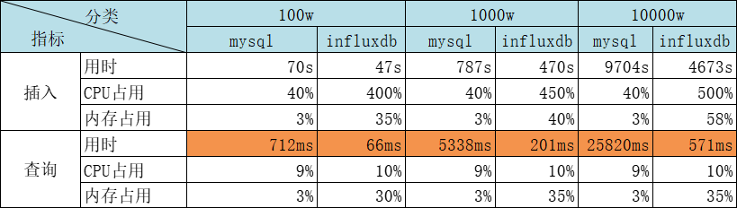
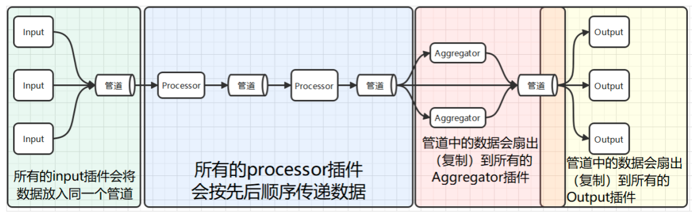

# influxDB安装使用教程
## 介绍
> InfluxDB是一个开源的、高性能的时序型数据库，并且在时序型数据库DB-Engines Ranking上排名第一。专门用于收集、存储、处理和可视化时间序列数据的平台。 时间序列数据是按时间顺序索引的数据点序列。数据点通常由同一来源的连续测量组成，用于跟踪随时间的变化。


官网：https://www.influxdata.com/

教程：https://docs.influxdata.com/influxdb/v2/


时间序列数据的示例包括：
- 工业传感器数据
- 服务器性能指标
- 每分钟心跳数
- 大脑的电活动
- 降雨量测量
- 股票价格

### 使用场景

  
1. 监控和运维：InfluxDB 适用于实时监控和运维数据的存储和查询。它可以用于收集和存储服务器性能指标、网络流量、应用程序性能数据等，便于管理员和开发人员实时监控系统状态、检测异常和进行故障排查。
2. 物联网（IoT）和传感器数据：InfluxDB 的高写入性能和优化的存储结构使其成为物联网和传感器数据的理想选择。它可以轻松处理大量传感器产生的数据，并提供快速的查询功能，用于实时数据分析和实时反馈。
3. 实时数据分析：时序数据库适用于需要对大量实时数据进行分析和处理的场景。InfluxDB 支持数据的连续写入和高效查询，使其成为实时数据分析的有力工具，例如时序数据的图表展示、异常检测、实时报警等。自动化报警与响应系统，通过Kapacitor处理复杂的触发条件。
4. 日志数据：InfluxDB 也可以用于存储和查询日志数据。它支持日志数据的时序化存储，使日志数据按照时间顺序进行组织，方便查询和分析，特别适合在分布式系统和微服务架构中处理大量的日志数据。
5. 能源监测：时序数据库可以用于能源监测和管理，例如电力、水、气等能源的数据采集和分析。InfluxDB 可以帮助监测能源的使用情况、趋势和效率，以优化资源利用和降低能源消耗。
6. 金融数据：在金融领域，时序数据库可以用于存储和分析金融市场的交易数据、股票价格、货币汇率等时序性数据，为金融决策和交易提供支持。
7. 工业自动化：InfluxDB 适用于工业自动化系统中的数据采集和监测，例如工厂生产线的监控数据、设备运行状态、温度和湿度数据等。

### 数据结构
InfluxDB 数据模型将时间序列数据组织到存储桶和测量中。一个桶可以包含`多个测量值`。测量包含多个`标签`和`字段`。

- bucket（存储桶）：存储时间序列数据的指定位置。一个桶可以包含多个测量值。也就是类似关系型数据库中的库
- measurement（度量）：时间序列数据的逻辑分组。给定测量中的所有点都应具有相同的标签。一个测量包含多个标签和字段。也就是类似关系型数据库中的表
- point（数据端点）：通过测量、标签键、标签值、字段键和时间戳来标识的单个数据记录。也就是类似于关系型数据库中的行
- Tags（键值对）：其值不同，但不经常更改。标签用于存储每个点的元数据 
  - 例如，用于识别数据源（如主机、位置、站点等）的东西。
- field（字段）：键值对，其值随时间变化，例如：温度、压力、股票价格等。
- Timestamp（时间戳）：与数据关联的时间戳。当存储在磁盘上并查询时，所有数据都按时间排序。

### 对比

执行速度：


## 安装
官网安装教程地址：https://docs.influxdata.com/influxdb/v2/install/
### 通过下载安装包安装
在[官网安装教程地址](https://docs.influxdata.com/influxdb/v2/install/)根据不同的系统选择对应的类型进行下载安装。
#### CentOS系统
- 安装
```bash
# Add the InfluxData key to verify downloads
curl --silent --location -O \
https://repos.influxdata.com/influxdata-archive.key \
&& echo "943666881a1b8d9b849b74caebf02d3465d6beb716510d86a39f6c8e8dac7515  influxdata-archive.key" \
| sha256sum --check - && cat influxdata-archive.key \
| gpg --dearmor \
| tee /etc/pki/rpm-gpg/RPM-GPG-KEY-influxdata > /dev/null

# Add the InfluxData repository to the repository list.
cat <<EOF | tee /etc/yum.repos.d/influxdata.repo
[influxdata]
name = InfluxData Repository - Stable
baseurl = https://repos.influxdata.com/stable/\$basearch/main
enabled = 1
gpgcheck = 1
gpgkey = file:///etc/pki/rpm-gpg/RPM-GPG-KEY-influxdata
EOF

# Install influxdb
sudo yum install influxdb2
```
- 启动
```bash
sudo service influxdb start
```

- 查询状态
```bash
sudo service influxdb status
#---------------------------正常的状态--------------------
● influxdb.service - InfluxDB is an open-source, distributed, time series database
   Loaded: loaded (/lib/systemd/system/influxdb.service; enabled; vendor preset: enable>
   Active: active (running)
```

#### Windows系统
> 系统要求：
> - Windows 10
> - 64-bit AMD architecture
> - Powershell or Windows Subsystem for Linux (WSL)

- 下载安装包，并解压
- 在文件目录下启动： `./influxd`

### 通过docker安装
#### 直接用命令
```bash
docker run \
 --name influxdb2 \
 --publish 8086:8086 \
 --mount type=volume,source=influxdb2-data,target=/var/lib/influxdb2 \
 --mount type=volume,source=influxdb2-config,target=/etc/influxdb2 \
 --env DOCKER_INFLUXDB_INIT_MODE=setup \
 --env DOCKER_INFLUXDB_INIT_USERNAME=ADMIN_USERNAME \
 --env DOCKER_INFLUXDB_INIT_PASSWORD=ADMIN_PASSWORD \
 --env DOCKER_INFLUXDB_INIT_ORG=ORG_NAME \
 --env DOCKER_INFLUXDB_INIT_BUCKET=BUCKET_NAME \
 influxdb:2

```
#### 通过docker-compose.yml
docker-compose.yml
```yml
version: '3'
services:
  #influxdb服务
  influxdb:
    container_name: influxdb2.7
    image: influxdb:2.7
    ports:
      - '8086:8086'
    restart: always
    volumes:
      - /root/influxdb/data:/var/lib/influxdb2
      - /root/influxdb/config/influxdb.conf:/etc/influxdb2/influxdb.conf
    environment:
      TZ: "Asia/Shanghai"
```

## 访问
http://ip:8086

用户名：admin
密码：自定义

> 第一次登陆需将API Token 保存好！！！

### 通过nodejs读取数据

#### 安装依赖
```bash
# 安装依赖
npm install --save @influxdata/influxdb-client
```

#### 设置环境变量
```bash
# 设置环境变量
export INFLUXDB_TOKEN=第一次登陆时生成的API_TOKEN
```

#### 初始化客户端，操作数据库
- 打开NodeJs命令窗口：`node`
- 代码，初始化客户端
  ```js
  repl.repl.ignoreUndefined=true
  const {InfluxDB, Point} = require('@influxdata/influxdb-client')
  const token = process.env.INFLUXDB_TOKEN
  const url = 'http://localhost:8086'
  const client = new InfluxDB({url, token})
  ```
- 写数据
  ```js
  let org = `组织名称`
  let bucket = `test`

  let writeClient = client.getWriteApi(org, bucket, 'ns')

  for (let i = 0; i < 5; i++) {
    let point = new Point('measurement1')
      .tag('tagname1', 'tagvalue1')
      .intField('field1', i)

    void setTimeout(() => {
      writeClient.writePoint(point)
    }, i * 1000) // separate points by 1 second

    void setTimeout(() => {
      writeClient.flush()
    }, 5000)
  }
  ```
- 查数据
  ```js
  let queryClient = client.getQueryApi(org)
  # 查询最近10分钟的数据，过滤，求平均数
  let fluxQuery = `from(bucket: "test")
  |> range(start: -10m)
  |> filter(fn: (r) => r._measurement == "measurement1")
  |> mean()`

  queryClient.queryRows(fluxQuery, {
    next: (row, tableMeta) => {
      const tableObject = tableMeta.toObject(row)
      console.log(tableObject)
    },
    error: (error) => {
      console.error('\nError', error)
    },
    complete: () => {
      console.log('\nSuccess')
    },
  })
  ```


### 通过python操作influxdb

#### 安装依赖
```bash
pip3 install influxdb-client
```

#### 设置环境变量
```bash
# 设置环境变量
export INFLUXDB_TOKEN=第一次登陆时生成的API_TOKEN
```

#### 初始化客户端，操作数据库 
打开Python命令行窗口：`python3`
```python
import influxdb_client, os, time
from influxdb_client import InfluxDBClient, Point, WritePrecision
from influxdb_client.client.write_api import SYNCHRONOUS

# 初始化客户端
token = os.environ.get("INFLUXDB_TOKEN")
org = "组织名称"
url = "http://localhost:8086"

client = influxdb_client.InfluxDBClient(url=url, token=token, org=org)

# 写数据
bucket="test"

write_api = client.write_api(write_options=SYNCHRONOUS)
   
for value in range(5):
  point = (
    Point("measurement1")
    .tag("tagname1", "tagvalue1")
    .field("field1", value)
  )
  write_api.write(bucket=bucket, org=org, record=point)
  time.sleep(1) # separate points by 1 second


# 查询数据
query_api = client.query_api()

query = """from(bucket: "test")
 |> range(start: -10m)
 |> filter(fn: (r) => r._measurement == "measurement1")"""
tables = query_api.query(query, org=org)

for table in tables:
  for record in table.records:
    print(record)


```


## 使用
[InfluxDB官方文档](https://docs.influxdata.com/influxdb/v2/)

~~[InfluxDB关键概念](https://docs.influxdata.com/influxdb/v2/reference/key-concepts/)：了解编写时间序列数据的重要概念~~

[InfluxDB 大学](https://university.influxdata.com/):免费实践课程将教授您技术技能和最佳实践去使用influxDB充分利用实时数据。

[Python简单应用示例](https://github.com/influxdata/iot-api-python): 展示一个用Python写的简单IoT简单应用App。

[NodeJs简单应用示例](https://github.com/influxdata/iot-api-js): Node.js写的简单IoT简单应用App。

[代码样板片段](https://github.com/InfluxCommunity/sample-flask/blob/main/app.py):使用代码片段开始写入和查询数据。

### 命令
```bash

# 写数据
.\influx write --bucket iot-test --url https://influx-testdata.s3.amazonaws.com/air-sensor-data-annotated.csv
```

## Telegraf：InfluxDB的数据采集代理
> Telegraf是一个基于插件的开源指标采集工具。本身是为InfluxDB（一款时序数据库）量身打造的数据收集器，但是它过于优秀，能够将抓取的数据写到很多地方，尤其在时序数据库领域，很多时序数据库都能够与它配合使用。通常，它每隔一段时间抓取一批指标数据（比如机器的CPU使用情况，磁盘的IO，网络情况，MySQL服务端的的会话数等等）并将他们发送到时序数据库、消息队列中或者自定义导出到某个地方。

[telegraf教程](https://docs.influxdata.com/telegraf/v1/)

### 安装telegraf
[安装包地址](https://www.influxdata.com/downloads/) 


<!-- tab Centos通过命令行安装-->
通过命令行安装
```bash
# 安装
sudo yum install telegraf
# 配置文件：`/etc/telegraf/telegraf.conf`
# 启动
cd /etc/telegraf/
./telegraf --config telegraf.conf
```


<!-- endtab -->

<!-- tab windows通过下载安装包安装-->
通过下载[安装包](https://www.influxdata.com/downloads/) 安装

- 下载地址：https://dl.influxdata.com/telegraf/releases/telegraf-1.32.1_windows_amd64.zip
- 下载后解压，修改`telegraf.conf`文件
- 启动命令：`./telegraf --config telegraf.conf`
<!-- endtab -->



### 生成配置文件（可跳过）

#### 默认的输入和输出插件


<!-- tab linux-->
```bash
# centos
telegraf config > telegraf.conf
```
<!-- endtab -->

<!-- tab windows-->
```bash
# windows
.\telegraf.exe config > telegraf.conf
```
<!-- endtab -->


#### 特定的输入和输出插件
> 通过 `--input-filter` 和 `--output-filter` 参数使用特定的输入输出插件


<!-- tab linux-->
```bash
# centos
telegraf \
--input-filter cpu:http \
--output-filter influxdb_v2:file \
config > telegraf_cpu.conf
```
<!-- endtab -->

<!-- tab windows-->
```bash
# windows
.\telegraf.exe `
--input-filter cpu:http `
--output-filter influxdb_v2:file `
config > telegraf.conf

```
<!-- endtab -->



### 自定义配置插件
> telegraf内部包含四种插件：输出插件、处理插件、聚合插件、输出插件

[telegraf插件列表](https://docs.influxdata.com/telegraf/v1/plugins/)



#### Agent配置
|配置名	|直译 |解释|
|---|---|---|
|interval	|间隔	|所有的input组件采集数据的间隔时间|
|round_interval	|间隔取整	|将采集的间隔时间取整。比如，如果interval设置为10s，但我们在1分02秒启动了telegraf服务，那么采集的时间会取整到1分10秒，1分20秒，1分30秒|
|metric_batch_size	|指标 |批大小	telegraf一批次从output组件向外发送数据的大小，网络不稳定时可以减小此参数。|
|metric_buffer_limit	|指标 |缓冲区	telegraf会为每个output插件创建一个缓冲区，来缓存指标数据，并在output成功将数据发送后，将成功发送的数据从缓冲区删除。所以，metriac_buffer_limit参数应该至少是metric_batch_size参数的两倍|
|collection_jetter	|采集抖动	|这个参数会在采集的时间点上加一个随机的抖动，这样可以避免很多插件同时查询一些消耗资源的指标，从而对被观测的系统产生不可忽视的影响。|
|flush_interval	|刷新间隔	|所有output的输出间隔，这个参数不应该设的比interval（所有input组件的采集间隔）小。最大的实际发送间隔将会是|
|flush_jitter	|刷新抖动	|对output的输出时间加上一个随机的抖动，这主要是为了避免大量的Telegraf实例在同样的时间同时执行写入操作，出现较大的写入峰值。比如，flush_jitter设为5s，flush_interval设为10s意味着会在10~15秒的时候进行一次输出。|
|precision	|精度	|精度配置确定从输入插件接收的点中保留多少时间戳精度。所有传入的时间戳都被阶段为给定的精度。然后Telegraf用零填充截断的时间戳以创建纳秒时间戳，输出插件将以纳秒为单位发出时间戳。有效的精度为ns，us，ms和s。例如：如果精度设置为ms，则纳秒时间戳1480000000123456789将被截断为1480000000123毫秒精度，然后用0填充以生成新的，不太精确的纳秒时间戳1480000000123000000。输出插件不会进一步更改时间戳。如果是服务型的输出插件会忽略这个设置。|
|logfile	|日志文件	|自定义的日志名称，|
|debug	|调试	|使用debug模式运行Telegraf|
|quiet	|安静	|安静地运行Telegraf，只会提示错误信息|
|logtarget	|日志目标	|该配置用来空值日志的目标。它可以是"file"，“stderr"之一，如果是在Windows系统上，它还可以设为"eventlog”。设置为"file"时，输入文件由 logfile 配置项决定。|
|logfile	|日志文件	|指定logtarget指定为"file"时的日志文件名。如果设置为空，那么日志会输出到stderr上。|
|logfile_rotation_interval	|日志轮转间隔	|日志轮转间隔，多长时间开启一个新的日志文件，如果设置为0，那么就不按时间进行轮转。|
|logfile_rotation_max_size	|日志轮转大小	|当正在使用的日志文件的大小超过该值时，开启一个新的日志文件。当设置为0，表示不按照日志文件的大小进行日志轮转。|
|logfile_rotation_max_archives	|最大轮转存档数	|最大的日志归档数量，每一次日志轮转发生时，都会产生一个新的正在使用的日志文件，和一个归档（旧的不再使用的日志文件）|
|log_with_timezone	|日志时区	|设置日志记录要使用的时区，或者设为"local"即为本地时间。|
|hostname	|主机名	|覆盖默认的主机名，如果不设该值，那么os.Hostname( )的返回值。（os.Hostname）是Go语言标准库中的方法，可以获取当前机器的名称。|
|omit_hostname	|忽略主机名	|telegraf输出的指标数据中，有一个默认的|


#### input输入插件通用配置
[数据格式化输入](https://github.com/influxdata/telegraf/blob/master/docs/DATA_FORMATS_INPUT.md)

|配置名|	直译|	解释|
|---|---|---|
|alias|	别名|	给一个input插件实例进行命名。|
|interval|	间隔|	单个Input组件收集指标的间隔时间，插件中的interval配置比全局的interval配置的优先级要高。|
|precision|	精度|	单个Input组件的时间精度，覆盖|[agent]中的配置。精度配置确定从输出插件接收的点中保留多少时间戳精度。所有传入的时间戳都被阶段为给定的精度。然后Telegraf用零填充截断的时间戳以创建纳秒时间戳，输出插件将以纳秒为单位发出时间戳。有效的精度为ns，us，ms和s。例如：如果精度设置为ms，则纳秒时间戳1480000000123456789将被截断为1480000000123毫秒精度，然后用0填充以生成新的，不太精确的纳秒时间戳1480000000123000000。输出插件不会进一步更改时间戳。如果是服务型的输出插件会忽略这个设置。
|collection_jitter|	采集抖动|	单个Input组件的采集抖动|
|name_override|	重命名|	覆盖原来的测量指标名称，默认值为input组件的名称|
|name_prefix|	名称前缀|	指定要附加到度量值名称的前缀|
|name_suffix|	名称后缀|	指定要附加到度量值名称的后缀|
|tags|	标签集|	给当前input数据添加新的标签集。|

```bash
[[inputs.mqtt_consumer]]
  servers = ["tcp://localhost:1883"]
  qos = 0

  topics = [
    "sensor/#"
  ]

  insecure_skip_verify = true
  client_id = ""
  data_format = "json"
  # 默认测量名为mqtt_consumer，这里改成sensor
  name_override = "sensor"
  tag_keys = ["deviceID"]
  json_string_fields = ["rotation","temperature","sound","fault"]
```

发送数据到
```json
{"deviceID":"D01","rotation":11,"temperature":20.1,"sound":43,"fault":0}
```

#### output输出插件通用配置

|配置名|	直译|	解释|
|---|---|---|
|alias|	别名|	给一个output插件起一个别名|
|flush_interval|	刷新间隔|	单个output插件的输出间隔（覆盖全局配置）|
|flush_jitter|	刷新抖动|	单个output插件的输出时间抖动（覆盖全局配置）|
|metric_batch_size|	指标批次大小|	一次最多发送多少条数据（会覆盖全局配置）|
|metric_buffer_limit|	指标缓冲区上限|	未发送数据的缓冲区（会覆盖全局配置）|
|name_override|	重命名|	覆盖原来的指标名称，默认值为output的名称???|
|name_prefix|	名称前缀|	指标名称的前缀|
|name_suffix|	名称后缀|	指标名称的后缀|


#### Aggregator 聚合插件通用配置
|配置名|	直译|	解释|
|---|---|---|
|alias|	别名|	给一个Aggregator插件的实例命名|
|period|	期间|	聚合器对从now|-period 到now 之间的数据进行聚合。
|delay|	延迟|	聚合时进行一个小的延迟，防止在对时间戳为1000的数据进行聚合时，上游还在正在发送时间戳为1000的数据|
|grace|	宽限|	迟到多久的数据可以进入下一个聚合周期。|
|drop_original|	删除源|	默认为false，如果设置为true，袁术的指标数据就会从流水线上删除，不会发给下游的output插件|
|name_override|	名称覆盖|	给数据的指标名称重新命名|
|name_prefix|	名称前缀|	给指标名称加一个前缀|
|name_suffix|	名称后缀|	给指标名称加一个后缀|
|tags|	标记|	添加额外的标签集|

#### Processor 处理插件通用配置
|配置名|	直译|	解释|
|---|---|---|
|alias|	别名|	给Processor插件的示例起一个名字|
|order|	顺序|	这是处理器的执行顺序，如果没有制定，那么执行器的顺序就是随机的。注意！不是按照配置文件的先后顺序来的，而是随机。|

#### Metric filtering 指标过滤器通用配置
指标过滤器的配置可以卸载input，output

|配置名|	直译|	解释|
|---|---|---|
|namepass|	名称通过|	一个glob模式的字符串数组，仅有measurement名称与这个配置的参数能匹配的指标数据可以进入此插件。|
|namedrop|	名称删除|	一个glob模式的字符串数组，能匹配上measurement的数据直接删除。|
|fieldpass|	字段通过|	一个glob模式的字符串数组，只有能匹配上的字段才能通过|
|fielddrop|	字段删除|	一个glob模式的字符串数组，如果匹配上了就删除这个资源。|
|tagpass|	标签通过|	一个glob模式的字符串数组，tag能匹配上的数据才能通过|
|tagdrop|	标签删除|	一个glob模式的字符串数组，tag能匹配上的数据会被删除|
|taginclude|	标签包含|	一个glob模式的字符串数据，能匹配到其中一个的整条数据才能通过。|
|tagexclude|	标签不含|	tageinclude的反函数|

注意！由于YOML的解析方式，过滤器参数必须在插件定义的末尾来进行定义，负责后续的插件配置项将被截石位 tagpass或者tagdrop的一部分。


### 测试从mqtt获取数据到influxDB
- 创建配置文件`telegraf-mqtt.conf`
```bash
# Configuration for telegraf agent
[agent]
  ## Default data collection interval for all inputs
  interval = "10s"
  ## Rounds collection interval to 'interval'
  ## ie, if interval="10s" then always collect on :00, :10, :20, etc.
  round_interval = true

  metric_batch_size = 1000

  metric_buffer_limit = 10000

  collection_jitter = "0s"

  flush_interval = "10s"
  ## ie, a jitter of 5s and interval 10s means flushes will happen every 10-15s
  flush_jitter = "0s"
  ## Valid time units are "ns", "us" (or "µs"), "ms", "s".
  precision = ""
  ## Override default hostname, if empty use os.Hostname()
  hostname = ""
  ## If set to true, do no set the "host" tag in the telegraf agent.
  omit_hostname = false
[[outputs.influxdb_v2]]
  ## The URLs of the InfluxDB cluster nodes.
  ##
  ## Multiple URLs can be specified for a single cluster, only ONE of the
  ## urls will be written to each interval.
  ##   ex: urls = ["https://us-west-2-1.aws.cloud2.influxdata.com"]
  urls = ["http://localhost:8086"]

  ## Token for authentication.
  token = "$INFLUX_TOKEN"

  ## Organization is the name of the organization you wish to write to; must exist.
  organization = "组织名称"

  ## Destination bucket to write into.
  bucket = "iot-test"

# Read metrics from MQTT topic(s)
[[inputs.mqtt_consumer]]
  ## Broker URLs for the MQTT server or cluster.  To connect to multiple
  ## clusters or standalone servers, use a separate plugin instance.
  ##   example: servers = ["tcp://localhost:1883"]
  ##            servers = ["ssl://localhost:1883"]
  ##            servers = ["ws://localhost:1883"]
  servers = ["tcp://localhost:1883"]

  ## Topics that will be subscribed to.
  topics = [
    "telegraf/host01/cpu",
    "telegraf/+/mem",
    "sensors/#",
  ]

  ## The message topic will be stored in a tag specified by this value.  If set
  ## to the empty string no topic tag will be created.
  # topic_tag = "topic"

  ## QoS policy for messages
  ##   0 = at most once
  ##   1 = at least once
  ##   2 = exactly once
  qos = 0

  ## Connection timeout for initial connection in seconds
  # connection_timeout = "30s"

  ## If unset, a random client ID will be generated.
  # client_id = ""

  ## Username and password to connect MQTT server.
  username = "MQTT用户名"
  password = "MQTT密码"

  data_format = "influx"

  ## Enable extracting tag values from MQTT topics
  ## _ denotes an ignored entry in the topic path
  # [[inputs.mqtt_consumer.topic_parsing]]
  #   topic = ""
  #   measurement = ""
  #   tags = ""
  #   fields = ""
  ## Value supported is int, float, unit
  #   [[inputs.mqtt_consumer.topic.types]]
  #      key = type

```
- 启动：

  
    <!-- tab linux-->
    ```bash
      # 设置环境变量
      export INFLUXDB_TOKEN=第一次登陆时生成的API_TOKEN
      # 启动
      telegraf --config telegraf-mqtt.conf
    ```
    <!-- endtab -->

    <!-- tab windows-->
    ```bash
      # powershell设置临时环境变量
      $env:INFLUX_TOKEN=""
      # 启动
      ./telegraf --config http://localhost:8086/api/v2/telegrafs/0dd26624ad853000
    ```
    <!-- endtab -->
  

- 发送数据到mqtt服务器的主题`sensors/1`
  ```influx
  test2,deviceId=s01,name=测试,host=111 fs=34,available=183,used=157 1729755350000000000
  ```
  - influx格式： 测量名（表名）,标签1=值1,标签2=值2...  field1=value1,field2=value2... 时间戳
- 在influxdb查询是否获取到数据：
  - Load Data ——》 BUCKETS ——》 配置文件里的bucket ——》 选择对应的_measurement ——》 点击SUBMIT查询
  - 左上角可切换图表格式：Graph,Table...


### 常用命令

#### 基本命令
- `telegraf --help` 可以查看telegraf提供的相关命令和参数

- `telegraf config`: 打印完整的样本配置到标准输出。

- `telegraf version`: 打印版本信息。
  
- `telegraf --list-plugins`:查看可用插件列表

#### 配置相关

- `--config <file>`: 指定要加载的配置文件。

- `--config-directory` <directory>: 指定包含额外 *.conf 文件的目录。

- `--plugin-directory`: 指定包含 *.so 文件的目录，Telegraf 将递归搜索此目录并加载任何找到的插件。

- `--debug`: 启用调试日志。

- `--input-filter <filter>`: 过滤要启用的输入插件，分隔符为冒号。

- `--output-filter <filter>`: 过滤要启用的输出插件，分隔符为冒号。

- `--pidfile <file>`: 指定写入进程ID的文件。

- `--pprof-addr <address>`: 指定监听 pprof 的地址。如果为空，则不激活 pprof。

- `--processor-filter <filter>`: 过滤要启用的处理器，分隔符为冒号。

- `--quiet`: 以静默模式运行。

- `--section-filter`: 过滤要输出的配置部分，有效值包括 'agent', 'global_tags', 'outputs', 'processors', 'aggregators' 和 'inputs'。

- `--sample-config`: 打印完整的样本配置。

- `--test`: 收集指标、打印它们并退出；在测试模式下，不会运行处理器、聚合器和输出。

- `--test-wait`: 在测试模式下等待多长时间以完成服务输入。

- `--usage <plugin>`: 打印特定插件的使用信息，例如 'telegraf --usage mysql'。

#### 示例

- 生成 Telegraf 配置文件：`telegraf config > telegraf.conf`

- 仅定义 CPU 输入和 InfluxDB 输出插件的配置：`telegraf --input-filter cpu --output-filter influxdb config`

- 单次 Telegraf 收集，输出指标到 `stdout：telegraf --config telegraf.conf --test`

- 按配置文件中定义的所有插件运行 Telegraf：`telegraf --config telegraf.conf`

- 启用 CPU 和内存输入，以及 InfluxDB 输出插件的 Telegraf：`telegraf --config telegraf.conf --input-filter cpu:mem --output-filter influxdb`

- 带有 pprof 的 Telegraf 运行：`telegraf --config telegraf.conf --pprof-addr localhost:6060`

### 关联rabbitMQ

- rabbitmq安装插件
```bash
# 查询安装的插件列表
rabbitmq-plugins list 
# 安装需要的插件
rabbitmq-plugins enable rabbitmq_federation_management
```


## Chronograf：InfluxDB的图形化管理工具
> Chronograf是一个基于Web的图形化管理工具，用于管理InfluxDB数据库。它提供了一个直观的界面，用于创建仪表盘、可视化数据和管理数据库。

https://www.influxdata.com/time-series-platform/chronograf/

URL: http://localhost:8888
Username: admin
Password: admin


TODO https://blog.csdn.net/weixin_28235889/article/details/141618492

## Kapacitor：InfluxDB的流处理和告警引擎
> Kapacitor是一个流处理和告警引擎，用于处理InfluxDB中的实时数据。它可以执行数据转换、聚合和告警。

URL: http://localhost:9092
Username: admin
Password: admin


## Grafana

https://grafana.com/


URL: http://localhost:3000
Username: admin
Password: admin

