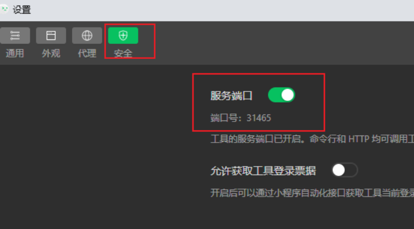
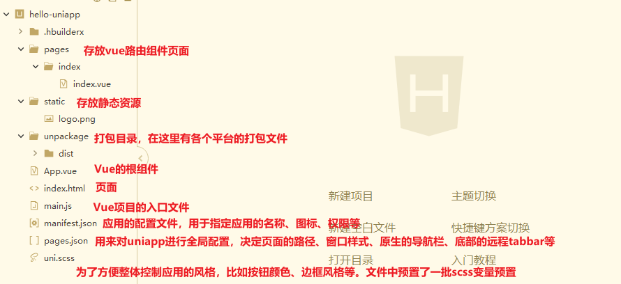

## 介绍

> uni-app 是一个使用 Vue.js 开发所有前端应用的框架，开发者编写一套代码，可发布到iOS、Android、Web（响应式）、以及各种小程序（微信/支付宝/百度/头条/飞书/QQ/快手/钉钉/淘宝）、快应用等多个平台。

【官网】：https://zh.uniapp.dcloud.io/

## 下载安装
### HBuilerX
下载地址：  https://www.dcloud.io/hbuilderx.html

HBuilerX介绍： https://hx.dcloud.net.cn/README

### 微信开发者工具
下载地址：https://developers.weixin.qq.com/miniprogram/dev/devtools/download.html

官方文档：https://developers.weixin.qq.com/miniprogram/dev/framework/

官方教程：https://developers.weixin.qq.com/community/business/course/000264e20a0dd8e69669b609451c0d

！！！注：微信开发者工具->设置->安全，然后把服务的端口号打开。

## 入门开发
### 新建uni-app项目
文件——》新建——》项目，选择 **默认模板**，选择vue版本，点击创建。

### 运行

<!-- tab 在浏览器运行-->
运行——》运行到浏览器——》选择Chrome

<!-- endtab -->

<!-- tab 在微信开发者工具运行-->
运行——》运行到小程序模拟器——》选择 微信开发者工具
<!-- endtab -->

<!-- tab 在手机上运行-->
运行——》运行到手机或模拟器——》选择 微信开发者工具
<!-- endtab -->



