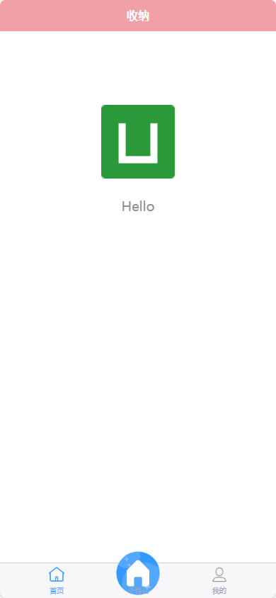
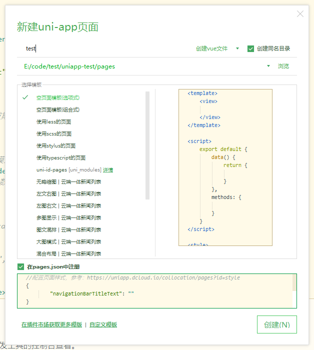
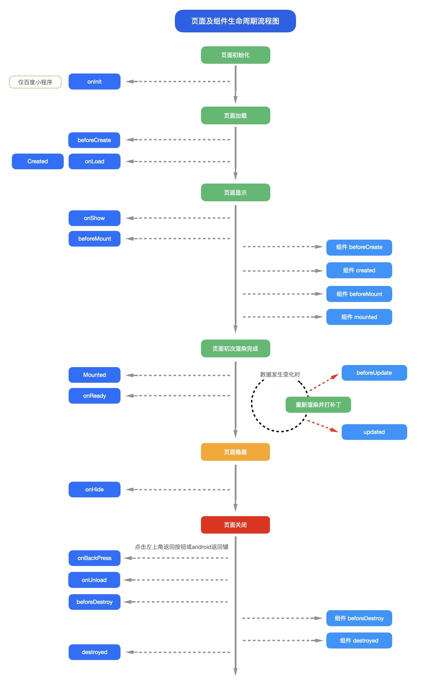
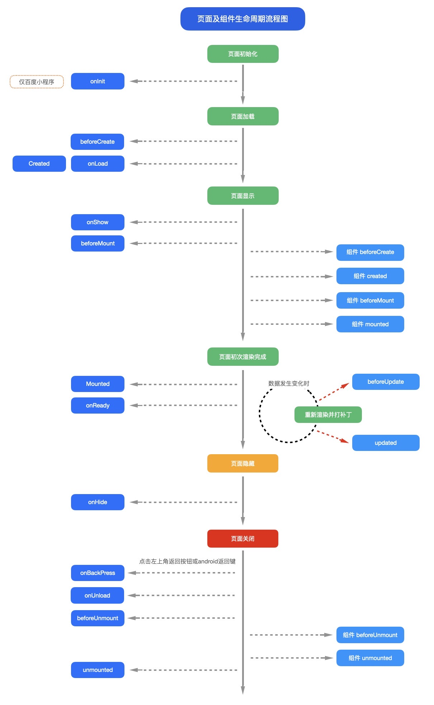

## 介绍

> uni-app 是一个使用 Vue.js 开发所有前端应用的框架，开发者编写一套代码，可发布到iOS、Android、Web（响应式）、以及各种小程序（微信/支付宝/百度/头条/飞书/QQ/快手/钉钉/淘宝）、快应用等多个平台。

【官网】：https://zh.uniapp.dcloud.io/


## 下载安装
### HBuilerX
下载地址：  https://www.dcloud.io/hbuilderx.html

HBuilerX介绍： https://hx.dcloud.net.cn/README


### 微信开发者工具
下载地址：https://developers.weixin.qq.com/miniprogram/dev/devtools/download.html

官方文档：https://developers.weixin.qq.com/miniprogram/dev/framework/

官方教程：https://developers.weixin.qq.com/community/business/course/000264e20a0dd8e69669b609451c0d


## 入门开发
### 新建uni-app项目
文件——》新建——》项目，选择 **默认模板**，选择vue版本，点击创建。


### 运行

<!-- tab 在浏览器运行-->
运行——》运行到浏览器——》选择Chrome
<!-- endtab -->

<!-- tab 在微信开发者工具运行-->
运行——》运行到小程序模拟器——》选择 微信开发者工具


！！！注：微信开发者工具->设置->安全，然后把服务的端口号打开。


<!-- endtab -->

<!-- tab 在手机上运行-->
运行——》运行到手机或模拟器——》选择 运行到Android
<!-- endtab -->



### 修改全局配置文件

#### pages.json 页面路由
> [pages.json](https://uniapp.dcloud.net.cn/collocation/pages.html) 文件用来对 uni-app 进行全局配置，决定页面文件的路径、窗口样式、原生的导航栏、底部的原生tabbar 等。


```json
{
	"pages": [ //pages（页面路由）:pages数组中第一项表示应用启动页，参考：https://uniapp.dcloud.io/collocation/pages
		{
			"path": "pages/index/index", //配置页面路径
			"style": {
				"navigationBarTitleText": "安亦殊" // 覆盖全局样式里的导航栏标题名称
			}
		},
		{
			"path" : "pages/test/index",
			"style" : 
			{
				"navigationBarTitleText" : "测试页"
				// "enablePullDownRefresh": true
			}
		},
		{
			"path" : "pages/ucenter/ucenter",
			"style" : 
			{
				"navigationBarTitleText" : "个人中心"
			}
		}
	],
	"condition": { //启动模式配置，仅开发期间生效，用于模拟直达页面的场景，如：小程序转发后，用户点击所打开的页面。
		"current": 0,
		"list": [
			{
				"name": "test", //启动模式名称
				"path": "pages/test/index" //启动页面路径
				// "query": "" //启动参数，可在页面的 onLoad 函数里获得
			}
		]
	},
	"tabBar": { // 指定一级导航栏，以及 tab 切换时显示的对应页。
		"color": "#99a5bb",//tab 上的文字默认颜色
		"selectedColor": "#55aaff",//tab 上的文字选中时的颜色
		// "backgroundColor": "#ffabb4", //tab 的背景色
		// "borderStyle": "white", //tabbar 上边框的颜色（默认black），可选值 black/white，也支持其他颜色值
		// "position": "top", //可选值 bottom、top。top 值仅微信小程序支持，但不显示图标
		"list": [
			{
				"pagePath": "pages/index/index", //页面路径，必须在 pages 中先定义
				"text": "首页", //tab 上按钮文字，在 App 和 H5 平台为非必填。例如中间可放一个没有文字的+号图标
				"iconPath": "static/images/tabbar/home.png", //图片路径，icon 大小限制为40kb，建议尺寸为 81px * 81px
				"selectedIconPath": "static/images/tabbar/home_.png" //选中时的图片路径，icon 大小限制为40kb，建议尺寸为 81px * 81px
			},
			{
				"pagePath": "pages/ucenter/ucenter",
				"text": "我的",
				"iconPath": "static/images/tabbar/mine.png",
				"selectedIconPath": "static/images/tabbar/mine_.png"
			}
		],
		"midButton": { // 个性化设置，目前只支持app、H5
			"iconPath": "static/images/tabbar/shouye.png",
			"iconWidth": "70px",
			"text": "个性化",
			"width": "70px",
			"height": "70px"
		}
	},
	"globalStyle": {
		"navigationBarTextStyle": "white", //导航栏文字颜色
		"navigationBarTitleText": "Anyisure", //导航栏标题名称
		"navigationBarBackgroundColor": "#f0a1a8", //导航栏背景色
		"backgroundColor": "#F8F8F8", //下拉显示出来的窗口的背景色
		"backgroundTextStyle": "dark", //下拉 loading 的样式，仅支持 dark / light
		"enablePullDownRefresh": true //开启下拉刷新
	},
	"uniIdRouter": {}
}


```

##### 个性化设置midButton

midButton目前只支持app、H5，无法在小程序展示。

且midButton没有`pagePath`，需监听点击事件，自行处理点击后的行为逻辑




#### manifest.json 应用配置
>[ manifest.json](https://uniapp.dcloud.net.cn/collocation/manifest.html) 文件是应用的配置文件，用于指定应用的名称、图标、权限等。HBuilderX 创建的工程此文件在根目录，CLI 创建的工程此文件在 src 目录。


### 新建页面
1）可以直接新建页面，也可以先创建目录，再创建文件。



2）在`pages.json`文件中的pages下添加页面路径，同时也可以配置一下页面样式。（上一步自动添加了）


### 组件(标签)
> 组件是视图层的基本组成单元。组件是一个单独且可复用的功能模块的封装。uniapp中除了可以使用html提供的默认标签外，uniapp还封装了一些组件可以使用。

#### text
> 文本组件。用于包裹文本内容。


|属性名|	类型|	默认值|	说明|	平台差异说明|
|---|---|---|---|---|
|selectable|	Boolean|	false|	文本是否可选|
|user-select|	Boolean|	false|	文本是否可选|	微信小程序|
|space|	String|		显示连续空格  `ensp`:中文字符空格一半大小；`emsp`:中文字符空格大小；`nbsp`:根据字体设置的空格大小。|	钉钉小程序不支持|
|decode|	Boolean|	false|	是否解码|	百度、钉钉小程序不支持|

```html
<text space="emsp">空 格</text>
```

#### icon
> 图标

属性说明

|属性名|	类型|	默认值|	说明|
|---|---|---|---|
|type|	String|		|icon的类型|
|size|	Number|	23|	icon的大小，单位px|
|color|	Color|		|icon的颜色，同css的color|

各平台 type 有效值说明：

|平台|	TYPE有效值|
|---|---|
|App、H5、微信小程序、QQ小程序|	success, success_no_circle, info, warn, waiting, cancel, download, search, clear|
|支付宝小程序|	info, warn, waiting, cancel, download, search, clear, success, success_no_circle,loading|
|百度小程序|	success, info, warn, waiting, success_no_circle, clear, search, personal, setting, top, close, cancel, download, checkboxSelected, radioSelected, radioUnselect|

```html
<icon type="success"></icon>
```

#### 字体图标
> uniapp 支持使用字体图标，使用方式与普通 web 项目相同，需要注意以下几点：

- 支持 `base64` 格式字体图标。
- 支持网络路径字体图标。
- 小程序不支持在 `css` 中使用本地文件，包括本地的背景图和字体文件。需以 `base64` 方式方可使用。
- 网络路径必须加协议头 `https`。
- 从  http://www.iconfont.cn 上拷贝的代码，默认是没加协议头的。下载的文件是同名字体（字体名都叫 `iconfont`），在 `nvue` 内使用时需要注意，此字体名重复可能会显示不正常，可以使用工具修改。
- 使用本地路径图标字体需注意：
  - 在字体文件小于 `40kb` 时，`uni-app` 会自动将其转化为 `base64` 格式；若字体文件大于等于 `40kb`，可能有性能问题，如开发者必须使用，则需自己将其转换为 `base64` 格式使用，或将其挪到服务器上，从网络地址引用；
  - 字体文件的引用路径推荐使用以 `~@` 开头的绝对路径。

在`App.vue`里引入全局样式：
```html
<style>
@import url("static/font/font_1/iconfont.css");
</style>
```

### 样式

`uni-app` 支持的通用 `css` 单位包括 `px`、`rpx`。

`rpx`即响应式px，一种根据屏幕**宽度自适应**的动态单位，以750宽的品目为基准，750rpx恰好为屏幕宽度，屏幕变宽，rpx实际显示效果会等比放大。

使用`@import`语句可以导入外联样式表，`@import`后跟需要导入的外联样式表的**相对路径**。

- 定义在 `App.vue` 中的样式为**全局样式**，作用于每一个页面。
- 在 `pages` 目录下 的 `vue 文件`中定义的样式为**局部样式**，只作用在对应的页面，并会覆盖 App.vue 中相同的选择器。

#### 选择器
目前支持的选择器有：

|选择器	|样例	|样例描述|
|---|---|---|
|.class	|.intro	|选择所有拥有 class="intro" 的组件|
|#id	|#firstname	|选择拥有 id="firstname" 的组件|
|element	|view	|选择所有 view 组件|
|element, element	|view, checkbox	|选择所有文档的 view 组件和所有的 checkbox 组件|
|::after	|view::after	|在 view 组件后边插入内容，仅 vue 页面生效|
|::before	|view::before	|在 view 组件前边插入内容，仅 vue 页面生效|

注意：

- 在 uni-app 中不能使用 `* 选择器`。

- 微信小程序自定义组件中仅支持 `class 选择器`

- `page` 相当于 `body` 节点
  

### uni-app生命周期
> 生命周期:一个对象从创建、运行、销毁的整个过程。

在生命周期中每个阶段会伴随着函数的触发，这些函数被称为**生命周期函数**。

#### 应用的生命周期
应用生命周期仅可在[App.vue/App.uvue](https://uniapp.dcloud.net.cn/collocation/App.html)监听，在页面监听无效。

uni-app支持如下应用生命周期函数:

|函数名|	说明|
|---|---|
|onLauch|	当uni-app初始化完成时触发（全局只触发一次）|
|onShow|	当uni-app启动，或从后台进入前台显示|
|onHide|	当uni-app从前台进入后台|
|onError|	当uni-app报错时触发|


#### 页面的生命周期

[uni-app 页面](https://uniapp.dcloud.net.cn/tutorial/page.html)除支持 Vue 组件生命周期外还支持下方页面生命周期函数，当以组合式 API 使用时，在 Vue2 和 Vue3 中存在一定区别，请分别参考：[Vue2 组合式 API 使用文档](https://uniapp.dcloud.net.cn/tutorial/vue-composition-api.html) 和 [Vue3 组合式 API 使用文档](https://uniapp.dcloud.net.cn/tutorial/vue3-composition-api.html)。

|函数名|	说明|	平台差异说明|	最低版本|
|---|---|---|---|
|onInit|	监听页面初始化，其参数同 onLoad 参数，为上个页面传递的数据，参数类型为 Object（用于页面传参），触发时机早于 onLoad	|百度小程序	|3.1.0+|
|onLoad|	监听页面加载，该钩子被调用时，响应式数据、计算属性、方法、侦听器、props、slots已设置完成，其参数为上个页面传递的数据，参数类型为Object（用于页面传参），参考示例。||		|
|onShow|	监听页面显示，页面每次出现在屏幕上都触发，包括从下级页面点返回露出当前页面|		||
|onReady|	监听页面初次渲染完成，此时组件已挂载完成，DOM 树($el)已可用，注意如果渲染速度快，会在页面进入动画完成前触发		|	||
|onHide|	监听页面隐藏|		||
|onUnload|	监听页面卸载|		||
|onResize|	监听窗口尺寸变化|	App、微信小程序、快手小程序|	|
|onPullDownRefresh|	监听用户下拉动作，一般用于下拉刷新，参考示例|		||
|onReachBottom|	页面滚动到底部的事件（不是scroll-view滚到底），常用于下拉下一页数据。具体见下方注意事项||		|
|onTabItemTap|	点击tab时触发，参数为Object，具体见下方注意事项	微信小程序、QQ小程序、支付宝小程序、百度小程序、H5、App、快手小程序、京东小程序	|||
|onShareAppMessage|	用户点击右上角分享|	微信小程序、QQ小程序、支付宝小程序、抖音小程序、飞书小程序、快手小程序、京东小程序|	|
|onPageScroll|	监听页面滚动，参数为Object|	nvue不支持|	|
|onNavigationBarButtonTap|	监听原生标题栏按钮点击事件，参数为Object|	App、H5|	|
|onBackPress|	监听页面返回，返回 event = {from:backbutton、 navigateBack} ，backbutton 表示来源是左上角返回按钮或 android 返回键；navigateBack表示来源是 uni.navigateBack；详见	|app、H5、支付宝小程序	||
|onNavigationBarSearchInputChanged|	监听原生标题栏搜索输入框输入内容变化事件|	App、H5|	1.6.0|
|onNavigationBarSearchInputConfirmed|	监听原生标题栏搜索输入框搜索事件，用户点击软键盘上的“搜索”按钮时触发。|	App、H5|	1.6.0|
|onNavigationBarSearchInputClicked|	监听原生标题栏搜索输入框点击事件（pages.json 中的 searchInput 配置 disabled 为 true 时才会触发）|	App、H5	|1.6.0|
|onShareTimeline|	监听用户点击右上角转发到朋友圈|	微信小程序|	2.8.1+|
|onAddToFavorites|	监听用户点击右上角收藏|	微信小程序、QQ小程序|	2.8.1+|



<!-- tab vue2页面及组件生命周期流程图-->

<!-- endtab -->

<!-- tab vue3页面及组件生命周期流程图-->

<!-- endtab -->



### API
[API概述](https://uniapp.dcloud.net.cn/api/)
#### 网络请求
[uni.request(OBJECT)](https://uniapp.dcloud.net.cn/api/request/request.html):发起网络请求。

data 数据说明:

最终发送给服务器的数据是 String 类型，如果传入的 data 不是 String 类型，会被转换成 String。转换规则如下：

- 对于 `GET` 方法，会将数据转换为 `query string`。例如 `{ name: 'name', age: 18 }` 转换后的结果是 `name=name&age=18`。
- 对于 `POST` 方法且 `header['content-type']` 为 `application/json` 的数据，会进行 `JSON 序列化`。
- 对于 `POST` 方法且 `header['content-type']` 为 `application/x-www-form-urlencoded` 的数据，会将数据转换为 `query string`。

示例:
```js
uni.request({
    url: 'https://www.example.com/request', //仅为示例，并非真实接口地址。
    data: {
        text: 'uni.request'
    },
    header: {
        'custom-header': 'hello' //自定义请求头信息
    },
    success: (res) => {
        console.log(res.data);
        this.text = 'request success';
    }
});
```

Tips：
- 请求的 `header` 中 `content-type` 默认为 `application/json`。
- 避免在 `header` 中使用中文，或者使用 `encodeURIComponent` 进行编码，否则在百度小程序报错。（来自：快狗打车前端团队）
- 网络请求的 `超时时间` 可以统一在 `manifest.json` 中配置 `networkTimeout`。


[API Promise 化](https://uniapp.dcloud.net.cn/api/#api-promise-%E5%8C%96):是指将**异步**操作通过**Promise对象**进行封装，使其能够以更简洁和可预测的方式处理异步操作。


<!-- tab vue2-->
```js
// 默认方式
uni.request({
  url: "https://www.example.com/request",
  success: (res) => {
    console.log(res.data);
  },
  fail: (err) => {
    console.error(err);
  },
});

// Promise
uni
  .request({
    url: "https://www.example.com/request",
  })
  .then((data) => {
    // data为一个数组
    // 数组第一项为错误信息 即为 fail 回调
    // 第二项为返回数据
    var [err, res] = data;
    console.log(res.data);
  });

// Await
async function request() {
  var [err, res] = await uni.request({
    url: "https://www.example.com/request",
  });
  console.log(res.data);
}

```
<!-- endtab -->

<!-- tab vue3-->
```js
// 默认方式
uni.request({
  url: "https://www.example.com/request",
  success: (res) => {
    console.log(res.data);
  },
  fail: (err) => {
    console.error(err);
  },
});

// 使用 Promise then/catch 方式调用
uni
  .request({
    url: "https://www.example.com/request",
  })
  .then((res) => {
    // 此处的 res 参数，与使用默认方式调用时 success 回调中的 res 参数一致
    console.log(res.data);
  })
  .catch((err) => {
    // 此处的 err 参数，与使用默认方式调用时 fail 回调中的 err 参数一致
    console.error(err);
  });

// 使用 Async/Await 方式调用
async function request() {
  try {
    var res = await uni.request({
      url: "https://www.example.com/request",
    });
    // 此处的 res 参数，与使用默认方式调用时 success 回调中的 res 参数一致
    console.log(res);
  } catch (err) {
    // 此处的 err 参数，与使用默认方式调用时 fail 回调中的 err 参数一致
    console.error(err);
  }
}

```
<!-- endtab -->




#### 数据缓存
[数据缓存](https://uniapp.dcloud.net.cn/api/#%E6%95%B0%E6%8D%AE%E7%BC%93%E5%AD%98): 将数据存储在本地缓存中

|API	|说明|
|---|---|
|uni.getStorage	|获取本地数据缓存|
|uni.getStorageSync	|获取本地数据缓存|
|uni.setStorage	|设置本地数据缓存|
|uni.setStorageSync	|设置本地数据缓存|
|uni.getStorageInfo	|获取本地缓存的相关信息|
|uni.getStorageInfoSync	|获取本地缓存的相关信息|
|uni.removeStorage	|删除本地缓存内容|
|uni.removeStorageSync	|删除本地缓存内容|
|uni.clearStorage	|清理本地数据缓存|
|uni.clearStorageSync	|清理本地数据缓存|