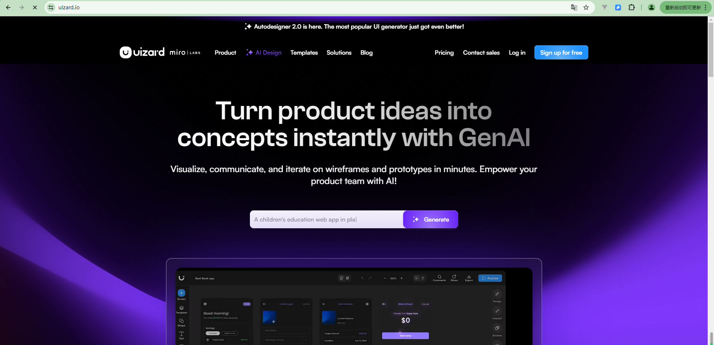
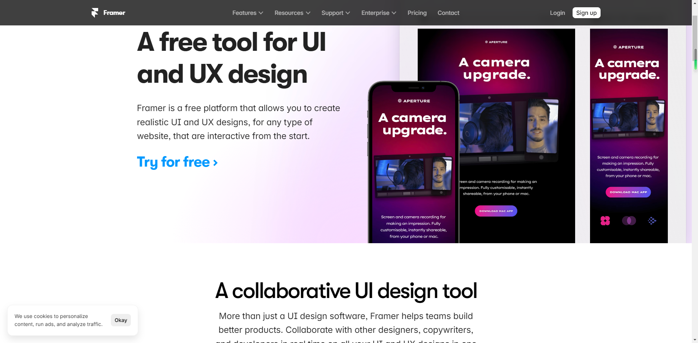
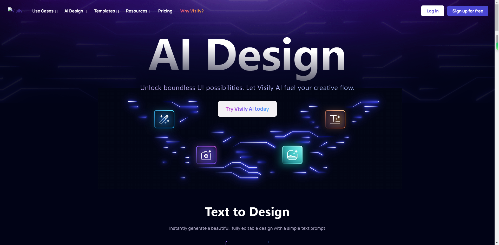
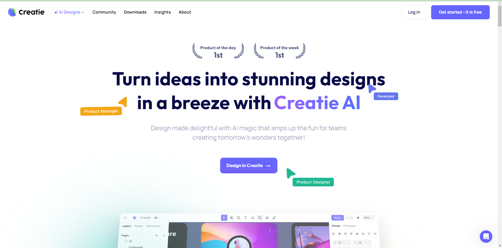

# AI原型设计工具

##  1.Uizard 
网址：https://uizard.io/

> Uizard是一款快速、由人工智能驱动的原型设计工具，可在几分钟内设计出草图、线框图和高保真原型。Uizard的人工智能功能使用户能够根据文本提示生成UI设计，将手绘草图转换为线框图，以及将屏幕截图转换为可编辑的设计。

功能亮点：

1)  文本生成设计稿：Uizard的人工智能技术可以根据用户提供的文本提示自动生成UI设计。用户只需简单描述他们的设计需求，Uizard就能快速生成相应的设计方案，节省了大量手动设计的时间和精力；

2)  手绘草图转换：只需拍摄或上传手绘草图，Uizard的人工智能会自动识别并将其转化为数字化的线框图，方便用户进一步编辑和优化设计；

3)  屏幕截图转换：只需上传屏幕截图，Uizard的人工智能会识别其中的设计元素并将其转化为可编辑的组件，用户可以进行进一步的编辑和调整；

4)  预制设计模板和UI组件：提供丰富的预制设计模板和UI组件，用户可以直接使用这些模板和组件来快速构建原型设计；

5)  快速协作与迭代：可以邀请团队成员共同参与设计过程，有助于团队高效地进行构思、讨论和改进设计，加快产品开发的速度。

价格：提供免费版本，付费版$12/人/月

学习难度：☆

使用环境：在线端, Windows, macOS, Linux, Android & iOS 

用户评价: 使用Uizard，你可以轻松设计移动应用程序、网站和软件界面。无需任何设计经验！

推荐理由: 简单易用、快速原型、AI界面设计、多平台支持、多人实时协作

推荐评级:☆☆☆☆☆

##  2.Framer
网址：https://www.framer.com/ui-ux-design-tool/

> Framer是一个功能强大的设计和交互原型工具，旨在帮助用户简化应用程序设计过程。其新增的AI功能可以帮助用户快速生成界面，提供独特的布局、文案和样式组合。

功能亮点：

1)  文本生成设计稿：它基于用户提供的输入，自动分析并生成最佳的布局方案，无论是简单的单页面设计还是复杂的多页面应用，Framer都能够应对；

2)  自动生成配色方案：可以混合搭配显示字体、文本字体和配色方案来构建设计的主题，可针对每个部分循环使用主题的不同变体；

3)  自动生成文案：Framer AI 可以自动优化设计稿的文案，只需点击段落旁边的按钮，新的文案将呈现在你眼前；

4)  数据驱动设计：支持通过导入和使用真实数据来创建动态原型，用户可以使用样本数据或导入实际数据集，以更真实地展示应用程序的功能和内容；

5)  团队协作：提供团队协作功能，允许设计师和开发人员在同一项目中共享和协同工作。

价格：提供免费版本，付费版$5/人/站

学习难度：☆☆

使用环境：在线端, Windows, macOS, Linux, Android & iOS 

用户评价: 我喜欢AI生成设计的速度，生成的文本准确地传达了设计概念, AI排版也非常漂亮。但遗憾的是，所选的配色方案相对单调。

推荐理由: 简单易用、AI配色方案、快速原型、数据驱动设计、多人实时协作

推荐评级:☆☆☆

##  3.Visily
网址：
- https://app.visily.ai/
- https://www.visily.ai/ai-design/

> Visily是一款快速的产品原型设计软件，可以帮助团队轻松快速地创建应用程序线框和原型，它内置了AI应用，可以将手绘的应用程序线框转换为高保真度的模型。

功能亮点：

1)  截图设计转换：只需将你想要使用的设计方案截图，上传至Visily，AI即可生成截图的网页和应用程序界面；

2)  手绘草图转换：在纸上绘制线框草图，然后使用 Visily AI 将其转换为可高度自定义的高保真度原型；

3)  配色方案优化：当你不确定自己的配色方案是否合适时，可以使用AI设计助手可以检测和修复常见的配色问题；

4)  设计系统提取：通过上传应用程序截图或标志，Visily能够提取出设计系统，帮助用户快速建立一致的设计风格和元素库；

5)  自定义模板：Visily提供了多种可定制和编辑的模板，用户可以根据自己的需求和品牌风格进行个性化的设计。

价格：免费

学习难度：☆☆

使用环境：在线端, Windows, macOS, Linux, Android & iOS 

用户评价: Visily至少减少了我90%的原型设计时间，让我的工作变得更轻松高效！

推荐理由: 简单易用、AI配色方案、AI生成高保真原型、模板多样

推荐评级:☆☆☆☆

##  4.CodeDesign.ai
网址：

> Codedesign.ai是一款基于人工智能的设计工具，可以根据用户输入的文本快速生成UI元素和设计稿界面。该设计工具提供更改颜色、字体和布局的能力，还提供设计的快速预览，并支持与团队成员的轻松协作。

功能亮点：

1)  AI生成UI元素和界面：根据用户的提示和需求，自动生成UI元素和设计稿，帮助用户快速创建视觉上吸引人的界面；1）

2)  智能建议系统：根据用户的设计需求和上下文，智能推荐相关的UI元素和内容，使设计过程更加高效和灵感丰富；

3)  SEO优化：AI技术可帮助用户在设计过程中优化网站的搜索引擎可见性，提升网站的排名和流量；

4)  快速预览和协作：提供设计的快速预览功能，让用户可以实时查看设计效果，同时还可以轻松与团队成员进行协作，共同编辑和完善设计。

价格：提供免费版本，付费版$15/月

学习难度：☆☆

使用环境：在线端, Windows, macOS, Linux, Android & iOS 

用户评价: 无论是为桌面、手机还是平板电脑做设计，Codedesign都能提供全面的响应式尺寸支持，助力轻松定制特定于移动设备的设计。

推荐理由: 简单易用、AI生成UI元素、AI生成原型图、SEO优化

推荐评级:☆☆☆☆

##  5.摹客RP
网址：

> 摹客RP是一款快速原型设计工具，它界面简洁、交互设置简单、组件库和模板丰富，助力产品经理或设计师在几分钟内完成高保真原型设计。其即将上线的AI功能，将全方位赋能原型设计过程，从PRD文档撰写到图片生成以及原型页面生成，帮助用户快速验证设计想法、优化用户体验，并提高产品开发的效率和质量。

功能亮点：

1)  自动生成和完善PRD文档: 在PRD文档撰写阶段，通过自然语言处理和机器学习技术，AI可以分析和理解用户输入的需求描述，自动生成相应的功能列表、流程图或用例场景，减少手动编写的工作量;

2)  自动生成图片：通过简单的描述或草图，让AI生成多个候选图像供选择，例如产品的外观设计、图标、背景图等，大大节省原型设计的时间和精力；

3)  自动生成原型界面：通过简单的拖放操作或描述，AI自动生成交互元素、布局和转场效果，快速创建交互式原型页面，加速设计流程；

4)  丰富的组件库和模板：内置丰富的组件库和模板，包括常用的UI元素、界面组件和交互效果，帮助用户快速构建原型并节省设计时间；

5)  设计协作和分享：提供设计协作和分享功能，支持多人共同编辑同一原型项目，还可与团队成员共享原型，并进行实时协作和反馈。

价格：个人版免费；团队版可申请试用

学习难度：☆

使用环境：在线端, Windows, macOS, Linux, Android & iOS 

用户评价: 摹客的交互动画功能真正解决了交互设计难的痛点，它提供了丰富的动画效果和转场效果，可以增强原型的交互性和真实感，使用户能够更好地理解产品的交互设计。

推荐理由: 简单易用、快速原型、强大交互、多平台支持、多人实时协作

推荐评级:☆☆☆☆☆

## 6.Creatie
网址： https://creatie.ai/

> Creatie 是一款免费的一站式 UI/UX 原型设计工具，支持界面设计、原型预览、多人协作、AI 生成等功能，支持一键导入 Sketch、Figma、XD、Axure 中的任意数量的文件，还可以在设计模式和 Dev 开发模式间自由切换，让设计人员与开发人员的交接可以变得更顺畅。

相关功能:
1) 「Al 图像增强器」，支持高清放大、外绘拓展、背景替换和高保真矢量化；
2) 「3D 图标生成器」Magicon，可以生成指定风格和构图的 3D 图标；
3) 「设计想法助手」CreatieWizard 等。
4) 它还能识别用户现有设计文件中的设计元素，比如字体、颜色、阴影等，将其创建为一个可复用的样式库，让用户可以更快捷地使设计风格保持一致。
